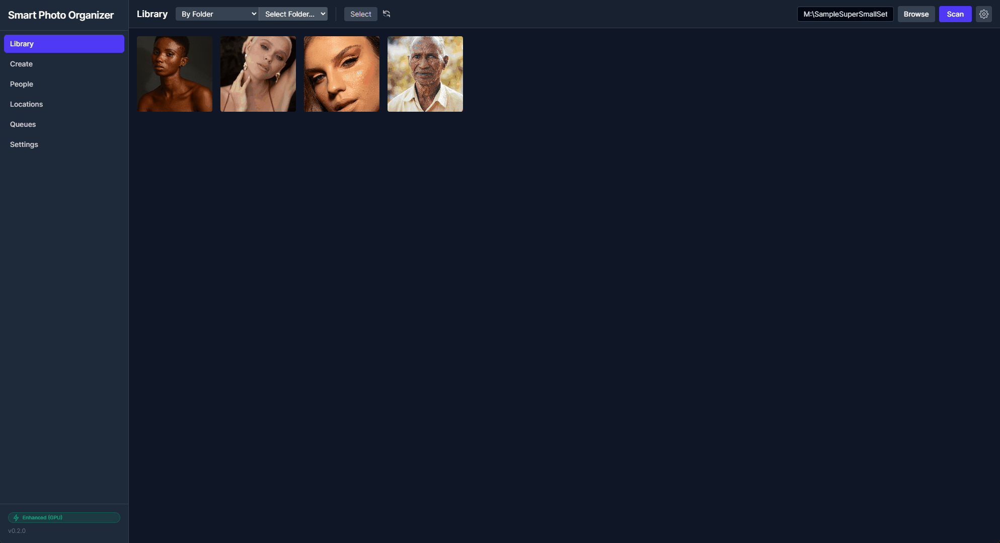
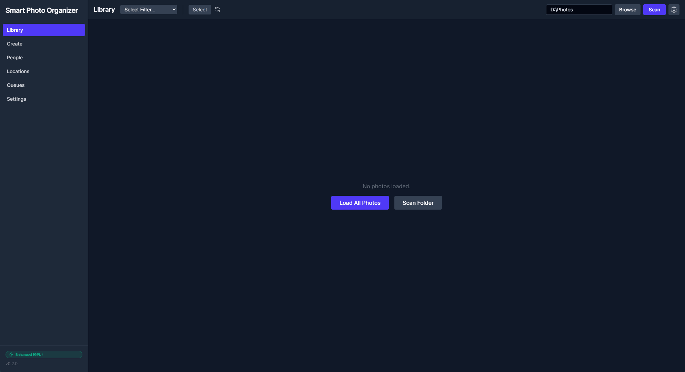

# Smart Photo Organizer

> A local-first, AI-powered photo management tool. Organize your memories without leaving your hard drive.

  

## Overview

Smart Photo Organizer uses advanced AI (InsightFace for people, SmolVLM for objects) to classify and organize your photo library. Unlike cloud services, **all processing happens locally** on your machine, ensuring your privacy.

> **Extreme Slim Installer:** The v0.3.5 release features a lightweight (~400MB) installer. While it works on CPU out-of-box, you can download the optional 5GB GPU Runtime for massive performance gains.

## Features at a Glance

*   **🕵️ Local AI Face Recognition:** Automatically detects and groups faces. **Smart Confidence Tiers** classify matches as High, Review (Amber Ring), or Unknown. Learns as you name them. Uses FAISS for lightning-fast similarity search across millions of faces.
    
    
*   **⚙️ Configurable AI & Storage:** Fine-tune face detection, blur sensitivity, and tagging creativity settings. Choose where your library data (DB, previews, indices) is stored.
*   **🧼 Blur Detection & Cleanup:** Automatically filters out blurry faces and provides tools to bulk-cleanup low-quality captures.
*   **🚫 Smart Background Filter:** One-click tool to automatically detect and ignore unwanted background faces (crowds, strangers) using advanced clustering.
*   **🏷️ Smart Tagging:** "Reads" your photos using vision models (VLM) to generate searchable tags and descriptions.
    
    
*   **✨ AI Enhancement Lab:** Upscale old photos (x4) and restore grainy or blurry faces using state-of-the-art models (Real-ESRGAN, GFPGAN).
*   **📷 RAW Support:** Native support for professional formats (Sony ARW, Canon CR2, Nikon NEF, etc.) with fast preview extraction.
*   **⚡ High Performance:** Virtualized grid and optimized backend handles libraries with 100,000+ photos smoothly.
*   **🔍 Semantic Search:** Search your photos by content, date, or person using AI-generated descriptions and tags.
*   **🎨 Set Builder (Create View):** Build custom collections by combining complex filters (e.g., "Person A AND Person B in 2024"). Export your sets to organized folders on disk.
    
    

## Hardware Requirements

| Component | Minimum (Basic) | Recommended (Enhanced) | Notes |
| :--- | :--- | :--- | :--- |
| **Processor** | Modern CPU (Intle i5/i7 8th Gen+, M1/M2) | CPU with AVX2 Support | Required for all operations. |
| **Graphics** | Integrated Graphics | **NVIDIA RTX 2060 (6GB)+** | **Crucial for AI Speed.** <br> • Face Scan: 10x faster <br> • Tagging: Required for VLM <br> • Upscaling: 20x faster |
| **RAM** | 8 GB System RAM | 16 GB System RAM | AI Models need ~4GB dedicated memory. |
| **Storage** | 1 GB Free Space | 10 GB Free Space | For AI Runtime (~6GB) and Database/Previews. |


## Documentation

For detailed examples of how the application works, logic flows, and architecture, please see the `docs/` folder:

*   **[User Instruction Manual](docs/user_manual.md):** The comprehensive guide to using every part of the app.
*   **[Features Guide](docs/features.md):** Detailed breakdown of technical capabilities and AI models.
*   **[Create & Set Builder](docs/create_feature.md):** Deep dive into the advanced search and album creation tools.
*   **[System Architecture](docs/architecture.md):** Diagrams of how Electron, React, and Python communicate.
*   **[Logic Examples & Flows](docs/logic_examples.md):** Detailed look at the Scanning, AI, and Enhancement logic.

## Usage Guide

### 1. Installation (Binaries)

The easiest way to get started is to download the latest release:

1.  **Download:** Grab the `Smart Photo Organizer-Windows-v0.3.5-Setup.7z` from the [Releases](https://github.com/arozz7/smart-photo-organizer/releases) page.
2.  **Unpack:** Extract the archive using [7-Zip](https://www.7-zip.org/) or WinRAR.
3.  **Run:** Open `Smart Photo Organizer.exe`.
4.  **GPU Setup (Automatic):** 
    *   Go to **Settings > Manage Models**.
    *   Click **"Download AI GPU Runtime"**. The app will automatically download and install it into your library folder (typically `%APPDATA%\smart-photo-organizer\library\ai-runtime`).
5.  **GPU Setup (Manual):**
    *   If you have the `ai-runtime-win-x64.zip` already, **do not** put it in the application folder.
    *   Instead, unzip its contents into the **`ai-runtime`** folder inside your **Library Path** (found in Settings). The final structure should be `[Library Path]\ai-runtime\lib\site-packages\...`

---

### 3. Releasing (Maintainers)

To create a new release for distribution:

1.  **Build App**: Run `npm run build`. This creates the application installer (e.g., `release/0.3.5/...-Setup.7z`).
2.  **GPU Runtime (Separate Asset)**: 
    *   The GPU Runtime is **NOT** bundled inside the Setup package (to keep it slim).
    *   You must create or reference a separate `ai-runtime-win-x64.zip` containing the `bin` and `lib` directories.
3.  **GitHub Release**: 
    *   Create a release on GitHub (e.g., `v0.3.5`).
    *   Upload the Setup package (`...-Setup.7z`).
    *   **CRITICAL:** Upload `ai-runtime-win-x64.zip` as a **separate standalone asset** to the same release. The application's downloader specifically looks for this filename in your GitHub releases to enable GPU support.

---

### 2. Running from Source (Development)

```bash
# 1. Install Dependencies
npm install

# 2. Setup Python Environment
cd src/python
python -m venv .venv
# Activate venv: .venv\Scripts\activate
pip install -r requirements.txt

# 3. Start Development Server
cd ../..
npm run dev
```

> [!NOTE]
> If running from source, you will need to manually install the GPU requirements: `pip install -r requirements-gpu.txt`.

### 2. Getting Started

1.  **Select Library:** On first launch, go to **Settings** and choose your photo folder. The app will creating a `photos.db` and `previews/` folder in a location you choose (or default to AppData).
2.  **Scan Photos:** Click **"Scan Library"**. The app will recursively find all images, generate previews, and extract metadata.
    
    
3.  **Detect Faces:** The AI will automatically start processing photos to find faces. You can watch the progress in the status bar.
4.  **Organize People:** Go to the **"People"** tab. You will see groups of "Unnamed Faces". Click one, type a name (e.g., "Mom"), and the AI will auto-group similar faces under that name.
    
    
5.  **Generate Tags:** Select photos and click **"Generate Smart Tags"** to have the AI describe them.

## Development

This project uses a hybrid architecture:
-   **Frontend:** React + TypeScript + Vite
-   **Backend:** Electron (Main Process) + Python (Subprocess)

See [Architecture](docs/architecture.md) for more details.

## License

GPL-3.0-or-later
