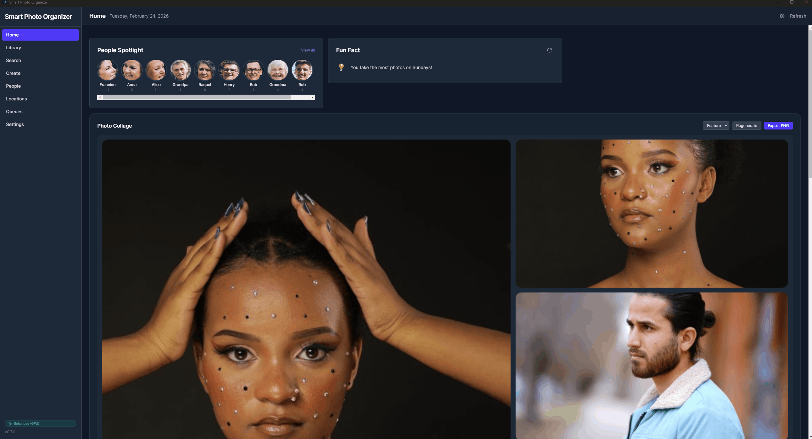
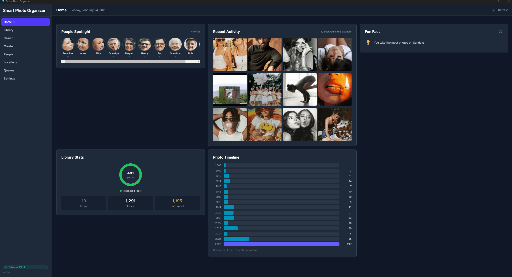
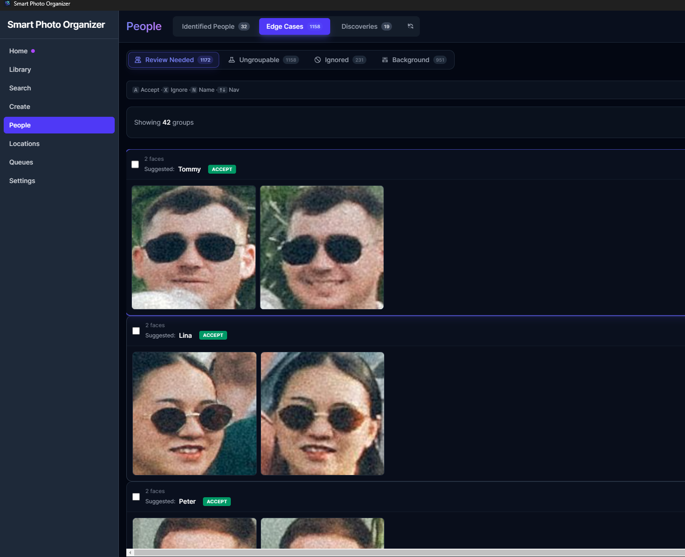

# Smart Photo Organizer

> A local-first, AI-powered photo management tool. Organize your memories without leaving your hard drive.

   

## Overview

Smart Photo Organizer uses advanced AI — **InsightFace** for people, **SmolVLM** for scene understanding — to automatically classify and organize your photo library. Unlike cloud services, **all processing happens locally** on your machine, ensuring your photos never leave your hard drive.

> **Slim Installer:** The installer is a lightweight (~400MB) package. Download the optional 5GB GPU Runtime separately for a 10–20x performance boost on face scanning and upscaling.

---

## Features

### 🏠 Home Dashboard

Your personal command center for your entire photo library.

<!-- GIF: Home dashboard overview — widgets, on-this-day memories, and the collage widget -->


- **On This Day:** Relive memories from this exact date in previous years using actual photo capture dates from EXIF metadata — not the import date.
- **Photo Collage:** Auto-generated daily collage from your "On This Day" photos. Choose between **Grid** (2×2 / 3×3), **Feature** (hero + supporting photos), or **Mosaic** (variable-height masonry) layouts. Regenerate with one click or export as PNG/JPG.
- **Photo Timeline:** Interactive bar chart of your library by year. Click a year to drill into monthly counts, then click a month to jump to the Search view filtered to that period.
- **Library Health:** Visual ring gauge showing processing completeness with an error breakdown by stage and one-click **CSV export** for diagnostics.
- **Location Heatmap:** World map showing GPS clusters from your photos' EXIF data. Hover over any cluster to see photo counts and coordinates.
- **People Spotlight:** Quick carousel of your most-photographed people.
- **Fun Facts:** Insights about your library — peak year, busiest day, most-used camera, and more.
- **Scan Entertainment:** Live discovery feed and memory flashbacks to watch while the AI works in the background.

**Fully Customizable Layout:** Drag and drop widgets to reorder them. Resize stat widgets by dragging the corner handle — they snap to a 4/8/12 column grid. Toggle individual widgets or choose from layout presets: **Minimal**, **Balanced**, and **Power User**. Your layout is saved automatically.

<!-- SCREENSHOT: Dashboard customize panel — widget toggles and layout presets -->

---

### 🖼️ Library

Browse and manage your entire photo collection with a high-performance virtualized grid that handles libraries of 100,000+ photos without lag.

<!-- GIF: Library grid → clicking a photo → photo detail panel with EXIF and AI tags -->


- **Photo Details:** Click any photo to view a large preview alongside EXIF metadata (camera model, lens, ISO, shutter speed, GPS) and AI-generated tags and descriptions.
- **Date Navigation:** Filter by year or month using the sidebar date picker.
- **Smart Orientation:** RAW files and mixed-orientation JPGs are automatically corrected — no manual rotation needed.
- **Context Menu:** Right-click any photo to re-scan it, remove it from the library, or open it in the AI Enhance Lab.
- **Force Face Scan:** Inside any photo detail view, trigger a high-sensitivity MACRO scan to find small or difficult faces the standard scan may have missed.
- **Ctrl+Scroll Grid Density:** Hold Ctrl and scroll to dynamically increase or decrease the grid column count. Each view remembers its own setting.

**Scan Errors Panel:** A badge in the Library header indicates corrupt or unreadable files found during scanning. Click it to open the Scan Errors panel — retry failed photos, export a full CSV error report, or clear resolved errors.

<!-- SCREENSHOT: Scan errors panel with export CSV button -->

---

### 👤 People & Face Recognition

The core of Smart Photo Organizer is its local, privacy-focused face recognition pipeline. All processing runs on your hardware — no cloud upload, ever.

<!-- GIF: People tab → unnamed face group → typing a name → faces auto-assigned -->



#### Detection & Recognition

- **Model:** InsightFace (Buffalo_L) — state-of-the-art face detection and 512-dimensional embedding extraction.
- **FAISS Index:** All face vectors are indexed with FAISS (Facebook AI Similarity Search), enabling near-instant similarity lookups even in libraries with millions of faces. Automatically upgrades to an IVF index at 2,000+ faces for ~10× search speed at scale.
- **Smart Cropping:** Portrait crops use facial landmark positions (eyes, nose, mouth) to center the head and neck naturally — not just a tight bounding box.

#### Confidence Tiers & Visual Indicators

| Ring | Meaning |
|------|---------|
| 🟢 Green | High-confidence auto-assignment (75%+ similarity). The AI is certain. |
| 🟡 Amber | Review suggestion (60–75% similarity). Click **Accept** to confirm. |
| **?** Badge | Weak match or challenging angle. Requires manual verification. |
| No Ring | Unknown face — no close match found in your library. |

<!-- SCREENSHOT: People view showing faces with green, amber, and unknown rings side by side -->


#### Naming & Management

- **Name a Face:** Click any unnamed group, type a name, and press Enter. The AI immediately learns the new identity and begins auto-assigning matching faces.
- **Merge People:** Rename one person to match another and the app merges all photos and faces into the target — useful when you accidentally create duplicates.
- **Ignore Background Faces:** Hide faces that aren't relevant (crowds, strangers, poster art). One-click bulk-ignore with the **Smart Background Filter**.

#### Unnamed Faces Workflow

<!-- GIF: Unnamed faces list → naming a group → keyboard shortcuts A/X/N in action -->


- **AI Suggestion Groups:** The AI clusters visually similar faces and annotates each group with its best identity suggestion. Accepting a group assigns all faces at once.
- **Ungroup:** Break apart a suggested group if it contains mixed faces — the faces return to the unmatched pool for individual sorting.
- **Keyboard Navigation (Power Users):**
  | Key | Action |
  |-----|--------|
  | `A` | Accept suggestion — name and advance |
  | `N` | Open naming modal — manual assignment |
  | `X` | Ignore group — hide from view |
  | `↑` / `↓` or `J` / `K` | Move between groups |
  | `/` | Start keyboard focus |
- **Cluster Size Filters:** Toggle buttons to focus on Large (10+), Medium (5–9), or Small (2–4) groups — useful when clearing thousands of unknowns.
- **Progressive Loading:** Scroll-triggered loading keeps the interface fast with 10,000+ face groups.

#### Background Face Bucketing

During idle time (between scans), a background service automatically processes unassigned faces:

- **Suggestions:** Groups of faces that closely match a known person — confirm or reject as a batch.
- **Discoveries:** New unknown clusters found by the AI — name or ignore them.
- **Re-check Ignored:** Periodically re-evaluates the ignored pool against your growing people database.
- **Zero Overhead:** The service pauses immediately when an active AI scan is running.

<!-- SCREENSHOT: Suggestions tab with a batch of faces matched to a named person -->

#### Smart Ignore Manager

A dedicated panel for managing all hidden faces:

- **Paginated View:** Browse thousands of ignored faces with fast pagination.
- **Group Similar:** Cluster your ignored pile to spot accidentally hidden important photos.
- **Sensitivity Slider:** Tune the matching threshold (0.1–0.95) to surface identity suggestions even for low-quality captures.
- **Restore & Assign:** Restore individual faces or entire groups with one click, optionally assigning them to a person immediately.

<!-- SCREENSHOT: Ignored faces manager with "Group Similar" clusters visible -->

#### Age-Based Eras

For people who appear across many years, the app automatically tracks **life stages** — Newborn, Infant, Toddler, Child, Teen, Young Adult, Adult, Senior, Elderly — and builds separate recognition models per era. This dramatically improves matching accuracy when a person's appearance changes significantly over time.

<!-- SCREENSHOT: Person detail showing eras (e.g., "Child 2010–2014", "Teen 2015–2019") -->

#### Challenging Face Recognition

Robust matching for difficult conditions using multi-sample voting and pose-aware thresholds:

- Side profiles (yaw > 30°)
- Partial faces and occlusions
- Low-quality or small face crops

#### Misassignment Detection

The app continuously analyzes each person's face collection for outliers — faces that don't match the person's embedding model. Suspected misassignments are flagged for review. You can also **confirm** correct faces to exclude them from future outlier checks.

#### Person Thumbnail Management

- **Pin a Cover:** Manually set any face crop as a person's cover photo.
- **Shuffle:** Pick a new high-quality random face as the cover.
- **Smart Fallback:** Automatically reverts to the sharpest available face if unpinned.

---

### 🧹 Blur Detection & Cleanup

- **Automatic Quality Scoring:** Every detected face is scored for sharpness (Laplacian variance). Extremely blurry faces are discarded during scanning based on your configurable threshold.
- **Cleanup Tool:** A dedicated high-performance virtualized grid shows all low-quality face captures across your library. Bulk-delete to keep your People view clean.
- **AdaFace Hybrid:** For faces that fall below the quality threshold but aren't discarded, the app switches to an AdaFace embedding model optimized for low-quality inputs — improving recognition accuracy for difficult captures with ~5–10ms overhead.

<!-- GIF: Blurry faces cleanup modal → selecting faces → bulk delete -->

---

### 🔍 Search & Advanced Filtering

A dedicated Search view with a powerful filter sidebar for building precise queries.

<!-- GIF: Search view → adding filters → results updating live -->

<!-- GIF: Search view filters in action — pending new asset -->

**Available Filters:**
- Blur quality score (sharp / blurry)
- Date range — by file date or EXIF capture date
- Camera model
- File type (JPG, PNG, RAW formats)
- Face attributes and person names
- AI-generated tags and descriptions

**Compound Logic:** Combine multiple filters using AND / OR / NOT operators with a visual filter builder. Mix person filters ("Person A AND Person B in the same photo from 2022") with tag filters for surgical precision.

**Smart Albums:** Save any filter combination as a named Smart Album. Smart Albums auto-update as your library grows — no manual curation needed.

<!-- SCREENSHOT: Filter builder with compound AND/OR logic and a saved Smart Album in the sidebar -->

---

### 🎨 Set Builder (Create View)

Build custom photo collections by combining complex filter criteria, then export them to a folder on disk.

<!-- GIF: Create view → adding filter rules → staging photos → exporting to folder -->

<!-- GIF: Create view → adding filter rules → staging photos → exporting to folder — pending new asset -->

- **Complex Multi-Person Filters:** Find photos containing multiple specific people (e.g., "Mom AND Dad, tagged 'birthday'").
- **Staging Set:** Browse filter results and cherry-pick individual photos into your Current Set.
- **Export Album:** Export the entire set to an organized folder on your computer — ready for printing, sharing, or archiving.

---

### 🏷️ Smart Tagging

The app uses **SmolVLM** (a lightweight Vision-Language Model) to "read" your photos and generate searchable content.

<!-- GIF: Selecting photos → triggering Smart Tag generation → tags appearing in detail panel -->

- **Auto-Captioning:** The AI generates a natural-language description of each photo (e.g., "A golden retriever running through a park on a sunny day").
- **Tag Extraction:** Keywords are parsed from the caption and stored as searchable tags (`dog`, `park`, `running`, `sunny`).
- **Semantic Search:** Search your library by content — type "beach sunset" to find photos even if those words never appeared in a filename or folder name.
- **Configurable Creativity:** Adjust the VLM temperature (0.1 = factual and deterministic, 0.8+ = diverse vocabulary with occasional hallucinations). Choose from Low / Medium / High presets.
- **Tag Normalization:** All tags are enforced as lowercase and single-word by default. A cleanup utility in Settings migrates any existing tags to this format.

> **Note:** Smart Tagging requires the AI GPU Runtime to be installed and an NVIDIA GPU with 4GB+ VRAM. It is not available in CPU-only mode due to memory bandwidth constraints.

---

### 📤 Blurry Photos Export

Export low-quality face crops directly for external review or training datasets.

- **Quality Grid:** A dedicated high-performance virtualized grid shows all blurry face captures across your library, sorted by sharpness score.
- **Bulk Export:** Select individual faces or all below a threshold and export as a ZIP archive with original filenames preserved.
- **Non-Destructive:** Exporting does not remove faces or photos from your library.

---

### 🎨 Creative Tools (SAM 3 Segmentation)

Apply AI-powered creative edits to any photo using an interactive canvas powered by **SAM 3 (Segment Anything Model 3)**.

<!-- SCREENSHOT: Creative Tools canvas with a subject selected, mask overlay visible, and the B&W BG result in the right panel — save as docs/assets/CreativeTools_Overview.png -->
> 📷 _[Screenshot: Creative Tools overview — canvas, mask overlay, result panel, and operations bar]_

Open **Tools → Creative Tools** and pick any photo from your library or click **Load File** to open from disk.

#### Interactive Prompt Modes

| Mode | How to use |
|------|------------|
| **□ Box** | Click and drag to draw a bounding box. Drag the box to reposition; drag any of 8 corner/edge handles to resize. Press `Delete` to clear. |
| **· Points** | Click to add foreground (+) or shift-click to add background (−) points. Drag a point to move it. Click a point to remove it. |
| **Text** | Type a natural-language description (e.g., `"person"`, `"red car"`) and press Enter or click **Segment**. Adjust the Confidence and Mask Quality sliders to refine results. |
| **⊡ Exemplar** | Draw a reference box around one example instance — SAM 3 finds all similar instances in the photo. Add exclusion boxes to remove false matches. |
| **Box + Points** | Switch to Points mode while a box is active — both prompts are combined for higher precision. |

<!-- SCREENSHOT: The four prompt mode examples in one panel — save as docs/assets/CreativeTools_PromptModes.png -->
> 📷 _[Screenshot: Prompt mode examples — box selection, points selection, text mode, exemplar mode]_

#### Operations

Click any operation to apply it — the **active operation is highlighted** in indigo. Click it again to toggle off (clear the result). Adjust **Feather** and **Invert Selection** in the controls bar before or after applying.

| Operation | Description |
|-----------|-------------|
| **Remove BG** | Erases everything outside the selected region, saving a transparent PNG. |
| **Isolate** | Extracts the selected subject onto a transparent background. |
| **B&W BG** | Keeps the subject in full color; converts the background to grayscale. |
| **Blur BG** | Gaussian blur on the background — drag the radius slider to control intensity. |
| **Pixelate BG** | Mosaic-style pixelation of the background — adjustable pixel size. |
| **Spotlight** | Darkens the background and keeps the subject at full brightness — drag the brightness slider. |
| **Fill BG** | Replaces the background with a solid color — click the color swatch to choose. |
| **Color Tint** | Overlays a semi-transparent color wash on the background — pick a color and set opacity. |
| **Sharpen** | Unsharp-mask sharpening on the selected region. |

<!-- SCREENSHOT: Operations bar showing an active indigo-highlighted button with result visible — save as docs/assets/CreativeTools_Operations.png -->
> 📷 _[Screenshot: Operations bar with "Blur BG" active (indigo ring) and blurred background result visible in the right panel]_

#### Photo Adjustments

Click **Adjust** in the toolbar to open the compact adjustments sidebar alongside the result panel. Sliders auto-apply with a short debounce — no Apply button needed.

| Control | Range | Effect |
|---------|-------|--------|
| **Temp** | −1 (cool) → +1 (warm) | Color temperature shift (3000K–10000K) |
| **Black** | 0–200 | Black point (shadow crush) |
| **White** | 55–255 | White point (highlight clip) |
| **Bright** | 0.0–2.0 | Brightness multiplier |
| **Contr** | 0.0–2.0 | Contrast multiplier |
| **Shdws** | −1–+1 | Shadow lift / crush |
| **Hi-lts** | −1–+1 | Highlight pull-down / lift |

Click a label to reset that slider. Click **↺** in the header to reset all. Use **Global** to adjust the whole photo, or **Seg** to restrict adjustments to the masked subject.

<!-- SCREENSHOT: Adjustments sidebar open alongside the result panel — save as docs/assets/CreativeTools_Adjustments.png -->
> 📷 _[Screenshot: Adjustments sidebar open, warm temperature applied to a portrait — before (result) and adjusted (result) side by side]_

#### Mask Editor

Once a mask is predicted, click **✏ Edit Mask** to enter the brush editor. Paint or erase pixels directly on the mask to refine edges the AI got wrong.

- **Paint / Erase** — toggle brush mode in the editing toolbar
- **Brush Size** — drag the slider
- **Undo / Redo** — `Ctrl+Z` / `Ctrl+Y` (up to 20 steps)
- Click **Done Editing** to commit the edited mask and re-apply any pending operation

<!-- SCREENSHOT: Mask editor mode — brush cursor visible, mask overlay showing painted additions — save as docs/assets/CreativeTools_MaskEditor.png -->
> 📷 _[Screenshot: Mask editor in action — brush cursor painting on a hair edge]_

#### Saving Results

| Action | Description |
|--------|-------------|
| **↓ Save to Library** | Saves the edited result alongside the original and adds it to your library. |
| **Copy to Clipboard** | Copies the result PNG directly to the system clipboard for pasting elsewhere. |
| **Send to Compose ↗** | Pushes the result as a new layer into the Compositing Workspace for multi-layer editing. |

> **Note:** Creative Tools requires the AI GPU Runtime for best performance. CPU inference is supported but significantly slower (~39s cold load for the first segmentation per session).

---

### 🖼️ Compositing Workspace

Combine multiple segments and photos into a single layered composition.

<!-- SCREENSHOT: Compositing workspace with two layers composited — save as docs/assets/Compositing_Overview.png -->
> 📷 _[Screenshot: Compositing workspace with a landscape background and an isolated portrait layer on top]_

Open **Tools → Compositing** or use **Send to Compose ↗** from Creative Tools to add a segment as a layer.

#### Layers

- **Add Layer** — click the **+** button in the Layers tab to add a photo from your library
- **Reorder** — drag layers up/down in the Layers panel to change stacking order
- **Bring to Front / Send to Back** — right-click a layer row for quick stacking shortcuts
- **Remove** — click the trash icon on any layer row

#### Per-Layer Transform

Select a layer, switch to the **Transform** tab, and interact directly on the canvas:

| Control | Canvas Gesture |
|---------|---------------|
| **Move** | Drag inside the transform box |
| **Resize** | Drag any of the 8 corner/edge handles |
| **Rotate** | Drag the rotation handle above the box |
| **Flip** | Click **↔ H** or **↕ V** in the sidebar |
| **Numeric Input** | Type exact X, Y, W, H, or Angle values in the sidebar |

<!-- SCREENSHOT: Transform box on a layer — rotation handle and resize handles visible — save as docs/assets/Compositing_Transform.png -->
> 📷 _[Screenshot: Transform box with handles visible on a composited portrait layer]_

#### Adjustments per Layer

Select a layer and open the **Adjustments** tab in the right panel to tone the layer independently. The same 7 adjustment controls as Creative Tools apply.

<!-- SCREENSHOT: Compositing adjustments tab — layer selected, sliders shown — save as docs/assets/Compositing_Adjustments.png -->
> 📷 _[Screenshot: Compositing workspace with adjustments panel open on the selected layer]_

---

### ✨ AI Enhancement Lab

Restore and upgrade low-quality or old photos using state-of-the-art generative AI models.

<!-- GIF: Enhancement lab → before/after slider → upscaling result -->

- **Upscaling (×4):** Powered by **Real-ESRGAN** — quadruples image resolution while intelligently reconstructing fine details. Ideal for old digital photos or small crops.
- **Face Restoration:** Powered by **GFPGAN** — targets human faces specifically to remove noise, blur, and compression artifacts, restoring crisp detail.
- **Hybrid Mode:** Upscale the full image and restore all faces in a single pass for the best combined result.
- **Before / After Slider:** Compare the original and enhanced version side-by-side with a draggable divider.
- **Non-Destructive:** Enhanced images are saved alongside the original with a suffix (e.g., `photo_upscaled.jpg`). Your originals are never modified.

<!-- SCREENSHOT: Enhancement lab showing before/after slider on a restored portrait -->

---

### 🔧 File Repair (Photo Repair Shop Integration)

SPO integrates with [Photo Repair Shop](https://photo-repair-shop.app), a companion desktop app, to recover corrupt photo files directly from the Scan Errors panel.

<!-- GIF: Scan errors panel → clicking repair button → progress bar → file re-ingested -->

1. Open **Settings → Scan Warnings**. If Photo Repair Shop is running, a **"🔧 PRS ready"** badge appears in the header.
2. Click the 🔧 button on any corrupt file row.
3. SPO sends the file to PRS for **analysis** — PRS identifies the corruption type and recommends a repair strategy.
4. SPO automatically submits a **repair job** using the suggested strategy, including healthy photos from your library as reference files for header-grafting repairs.
5. A **progress bar** updates every 2 seconds as PRS reports completion percentage and stage.
6. On completion, SPO **verifies** the repaired file (Sharp decode + AI analysis) before committing it to the library.
7. If verification passes: the scan error is cleared, the corrupt record removed, and the repaired file is re-ingested (face detection, tagging, etc.).
8. If verification fails: the row is marked **Unrepairable** with a persistent badge — no further repair attempts are made automatically.

All communication happens over `localhost:3847` only — no network egress. A per-session UUID token is required for all calls; SPO never logs the token value.

---

### 📷 RAW & Format Support

Native support for professional RAW formats with fast preview extraction:

| Type | Formats |
|------|---------|
| Standard | JPG, JPEG, PNG, WEBP |
| RAW | ARW (Sony), CR2 (Canon), NEF (Nikon), DNG, ORF (Olympus), RW2 (Panasonic), TIF/TIFF |

The app first attempts to extract the embedded JPEG preview from RAW files (fast). If that fails, it decodes the RAW directly using `sharp` as a reliable fallback. Previews are cached locally at up to 2560px for sharp face crops.

---

### ⚙️ Settings & Configuration

All settings are persisted automatically and applied on next launch.

<!-- SCREENSHOT: Settings modal open to AI Configuration tab -->

**Library Storage:**
- Choose where the database, previews, and AI indices are stored — any local drive or NAS path.
- **Move Library:** Safely relocate your library to a new path without data loss. A blocking modal prevents interference during the move.

**AI Configuration:**
- **Detection Threshold:** How strictly the AI looks for faces. Lower = more faces (more false positives). Higher = fewer, more confident detections.
- **Blur Threshold:** Minimum face sharpness score. Raise this to exclude soft or motion-blurred faces from your People view.
- **VLM Creativity (Temperature):** Controls Smart Tag diversity. Low = factual, High = expressive.
- **VLM Max Tokens:** Controls the length of AI-generated descriptions.

**Model Management:**
- Download the AI GPU Runtime (~5.8GB) directly from within the app.
- View which AI models are loaded and their current status.

---

## Hardware Requirements

| Component | Minimum | Recommended | Notes |
|:----------|:--------|:------------|:------|
| **CPU** | Intel i5/i7 8th Gen+ or Apple M1/M2 | Any modern CPU with AVX2 | Required for all operations |
| **GPU** | Integrated graphics | **NVIDIA RTX 2060 (6GB+ VRAM)+** | Face scan: 10× faster. Upscaling: 20× faster. Required for Smart Tagging. |
| **RAM** | 8 GB | 16 GB | AI models use ~4 GB during scanning |
| **Storage** | 1 GB free | 10 GB free | AI Runtime (~6 GB) + database + preview cache |

**Performance Reference:**

| Feature | CPU Only | GPU (Recommended) |
|:--------|:---------|:------------------|
| Face Detection | ~2–5s per photo | < 0.2s per photo |
| Smart Tagging | **Not Available** | Required — 4GB+ VRAM |
| Photo Upscaling (×4) | ~30–60s per photo | ~2–5s per photo |
| Face Restoration | ~10–20s per photo | ~1–2s per photo |

> **Smart Tagging** currently requires the AI GPU Runtime and an NVIDIA GPU. CPU-only mode is not supported due to memory bandwidth constraints.

---

## Getting Started

### Installation (Recommended)

1. **Download:** Grab the latest `Smart Photo Organizer-Windows-vX.X.X-Setup.7z` from the [Releases](https://github.com/arozz7/smart-photo-organizer/releases) page.
2. **Unpack:** Extract using [7-Zip](https://www.7-zip.org/) or WinRAR.
3. **Run:** Open `Smart Photo Organizer.exe`.
4. **GPU Runtime (In-App):** Go to **Settings → Manage Models** and click **"Download AI GPU Runtime"**. The app downloads and installs it automatically to your library folder.
5. **GPU Runtime (Manual):** If you already have `ai-runtime-win-x64.zip`, unzip its contents into the `ai-runtime` folder inside your Library Path (shown in Settings). The final structure should be `[Library Path]\ai-runtime\lib\site-packages\...`

<!-- GIF: First launch → Settings → selecting library path → downloading GPU runtime -->

### First Steps After Installation

1. **Select Library:** Go to **Settings** and choose where your photos are stored. The app creates a `photos.db` and `previews/` folder in the Library Path you choose (or defaults to `%APPDATA%\smart-photo-organizer`).
2. **Scan Photos:** Click **"Scan Library"**. The app recursively finds all images, generates previews, and extracts EXIF metadata.

   <!-- GIF: Clicking Scan Library → progress bar → photos appearing in Library grid -->

   <!-- GIF: Clicking Scan Library → progress bar → photos appearing in Library grid — pending new asset -->

3. **Detect Faces:** The AI starts processing photos for face detection automatically. Watch progress in the status bar at the bottom.
4. **Organize People:** Go to the **People** tab. Click a group of unnamed faces, type a name, and press Enter — the AI auto-groups matching faces under that name across your library.

   <!-- GIF: Naming a face group — pending new asset -->

5. **Generate Tags:** Select photos in the Library and click **"Generate Smart Tags"** to have the AI describe them and make them searchable.

---

## Running from Source (Development)

```bash
# 1. Install Node dependencies
npm install

# 2. Setup Python environment
cd src/python
python -m venv .venv
# Activate: .venv\Scripts\activate  (Windows) or source .venv/bin/activate (Mac/Linux)
pip install -r requirements.txt

# 3. Start the development server
cd ../..
npm run dev
```

> For GPU acceleration when running from source, install the GPU requirements: `pip install -r requirements-gpu.txt`

---

## Releasing (Maintainers)

1. **Build:** Run `npm run build`. This produces the installer (e.g., `release/0.8.0/...-Setup.7z`).
2. **GPU Runtime:** The GPU Runtime is **not** bundled in the installer to keep it slim. Reference or create a separate `ai-runtime-win-x64.zip` containing the `bin` and `lib` directories.
3. **GitHub Release:**
   - Create a release tagged `vX.X.X`.
   - Upload the Setup package (`...-Setup.7z`).
   - **Critical:** Upload `ai-runtime-win-x64.zip` as a **separate standalone asset** to the same release. The in-app downloader specifically looks for this filename.

---

## Architecture

This project uses a hybrid architecture:

- **Frontend:** React 18 + TypeScript + Vite
- **Main Process:** Electron (TypeScript) — file I/O, SQLite (better-sqlite3), image processing (sharp), IPC
- **AI Backend:** Python 3.12 subprocess — InsightFace, FAISS, SmolVLM, Real-ESRGAN, GFPGAN, SAM 3

See [System Architecture](docs/specs/architecture.md) and [Logic Examples](docs/specs/logic_examples.md) for detailed diagrams and flow documentation.

---

## Documentation

| Document | Description |
|:---------|:------------|
| [User Manual](docs/guides/user_manual.md) | Comprehensive guide to every feature |
| [Features Guide](docs/specs/features.md) | Technical breakdown of AI models and capabilities |
| [Create & Set Builder](docs/specs/create_feature.md) | Deep dive into advanced search and album creation |
| [System Architecture](docs/specs/architecture.md) | Diagrams of Electron ↔ React ↔ Python communication |
| [Logic Examples](docs/specs/logic_examples.md) | Scanning, AI, and enhancement logic flows |

---

## License

GPL-3.0-or-later
