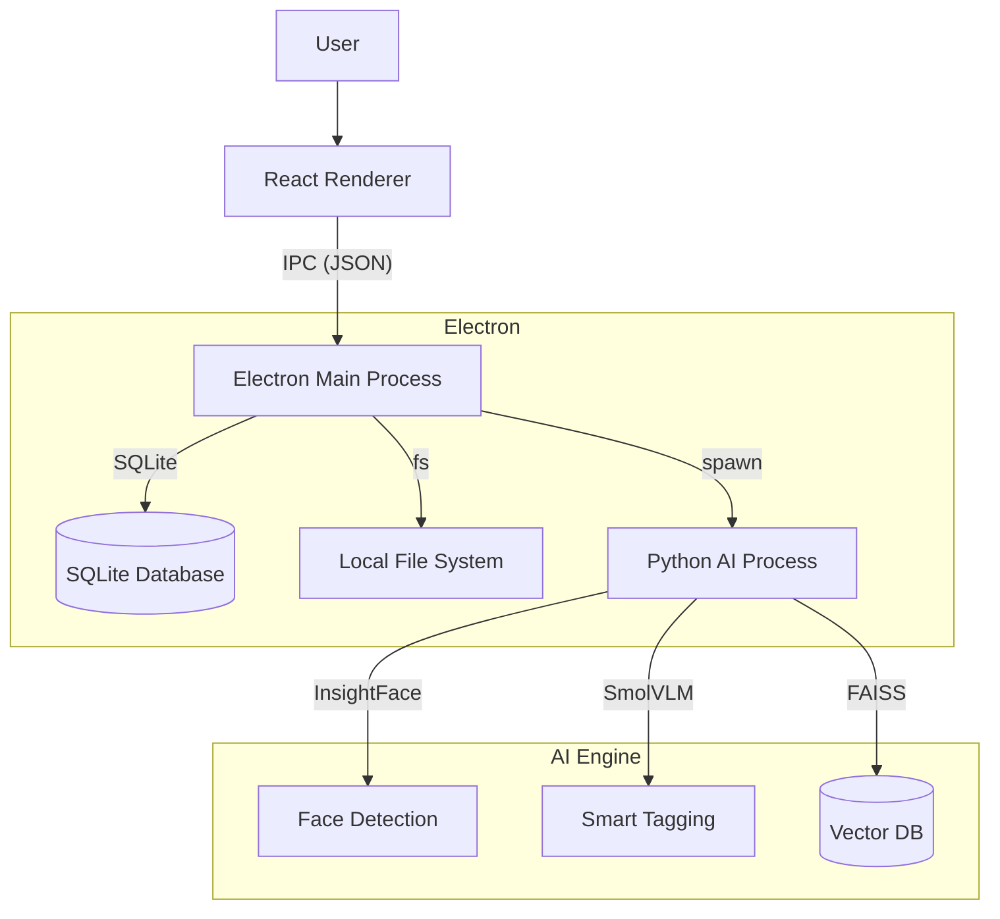

# System Architecture

## Overview

The Smart Photo Organizer is a local-first application built with Electron, React, and Python. It leverages a hybrid architecture where the UI and file management are handled by Node.js/Electron, while heavy AI tasks are offloaded to a dedicated Python subprocess.

## High-Level Diagram



## Component Breakdown

### 1. Renderer Process (Frontend)
- **Tech Stack:** React, TypeScript, Vite, TailwindCSS.
- **Responsibilities:**
  - displaying the photo grid (virtualized).
  - Managing application state (e.g., `AIContext`).
  - Sending commands to the main process via `window.electronAPI`.
  - displaying real-time progress of scans.

### 2. Main Process (Backend)
- **Tech Stack:** Electron, Node.js, SQLite (`better-sqlite3`).
- **Responsibilities:**
  - **Window Management:** Creates and manages the browser window.
  - **IPC Handlers:** `ipcMain.handle` receives requests from the UI.
  - **Database:** Manages `photos.db`, storing metadata, faces, and tags.
  - **Scanning:** `scanner.ts` recursively scans directories, extracting metadata (via `exiftool`) and generating previews (via `sharp` or `exiftool`).
  - **Process Management:** Spawns and manages the persistent `python.exe` process (AI Engine). Pipes `stdin`/`stdout` for communication.

### 3. AI Engine (Python)
- **Tech Stack:** Python 3.10+, PyTorch, InsightFace, FAISS, Transformers.
- **Responsibilities:**
  - **Face Detection:** Uses `Buffalo_L` (InsightFace) to detect faces and landmarks.
  - **Face Recognition:** Generates 512d embeddings for faces.
  - **Vector Search:** Uses `FAISS` to store and search face embeddings for clustering.
  - **Clustering:** Uses `DBSCAN` (scikit-learn) to group unnamed faces by similarity.
  - **Smart Tagging:** Uses `SmolVLM` (Vision-Language Model) to caption images and generate tags.

## Data Flow: AI Scanning

```mermaid
sequenceDiagram
    participant UI as React UI
    participant Main as Electron Main
    participant DB as SQLite
    participant Py as Python AI

    UI->>Main: IPC ai:scanImage(photoId)
    Main->>DB: Get file_path for photoId
    Main->>Py: { type: "scan_image", payload: { path: "..." } } (stdin)
    
    activate Py
    Py->>Py: Load Image (PIL/RawPy)
    Py->>Py: Detect Faces (InsightFace)
    Py->>Py: Smart Crop (Landmarks)
    Py-->>Main: { type: "scan_result", faces: [...] } (stdout)
    deactivate Py
    
    Main->>DB: db:updateFaces (Transaction)
    DB->>DB: Merge/Update Faces
    Main->>DB: db:updateFaces (Transaction)
    DB->>DB: Merge/Update Faces
    Main-->>UI: ai:scan-result (Event)

## Data Flow: Face Clustering (Unnamed Faces)

```mermaid
sequenceDiagram
    participant UI as React UI
    participant Main as Electron Main
    participant DB as SQLite
    participant Py as Python AI

    UI->>Main: IPC ai:getClusteredFaces()
    Main->>DB: Fetch ALL unnamed face descriptors
    DB-->>Main: [Face objects with BLOBs]
    
    Main->>Py: { type: "cluster_faces", faces: [...] }
    activate Py
    Py->>Py: DBSCAN (eps=0.4, min_samples=3)
    Py-->>Main: { clusters: { "-1": [], "0": [...], "1": [...] } }
    deactivate Py

    Main->>Main: Re-map IDs to Face Objects
    Main-->>UI: { clusters: [...], singles: [...] }
```

## Data Flow: Image Rotation

```mermaid
sequenceDiagram
    participant UI as React UI
    participant Main as Electron Main
    participant DB as SQLite
    participant Py as Python AI

    UI->>Main: IPC ai:rotateImage(photoId, angle)
    
    activate Main
    Main->>DB: Fetch existing faces
    Main->>Py: { type: "rotate_image", ... }
    Py-->>Main: Success (and new dims)
    
    rect rgb(20, 20, 20)
        note right of Main: **Re-Scan Strategy**
        Main->>Main: Transform old face coords (for matching keys)
        Main->>Py: { type: "analyze_image", ... }
        activate Py
        Py-->>Main: { faces: [NewBoxes...] }
        deactivate Py
        
        Main->>Main: Match NewBoxes to OldBoxes (Heuristic)
        Main->>DB: DELETE old faces
        Main->>DB: INSERT new faces (with preserved PersonIDs)
    end
    
    Main-->>UI: Success
    deactivate Main
```


```

## Data Schema

### SQLite Tables
- **photos:** `id`, `file_path`, `preview_cache_path`, `metadata_json`, `created_at`
- **faces:** `id`, `photo_id`, `box_json`, `descriptor` (BLOB), `person_id`, `is_reference`, `blur_score`
- **people:** `id`, `name`, `descriptor_mean_json`
- **tags:** `id`, `name`
- **photo_tags:** `photo_id`, `tag_id`, `source` ('AI' or 'User')
- **scan_history:** `id`, `photo_id`, `timestamp`, `scan_ms`, `tag_ms`, `face_count`, `status`, `error`

### Vector Store (FAISS)
- Stores 512-dimensional vectors for fast similarity search (currently used internally by Python, but key logic has moved to Node.js for "Mean" calculation).
