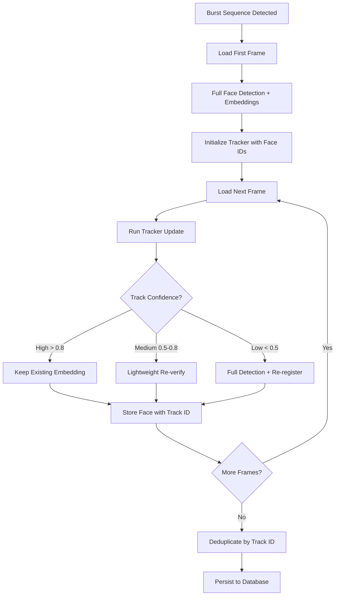

# Burst Photo Face Tracking - Implementation Plan

> **Document Purpose:** Technical specification and implementation roadmap for optimizing face processing in burst/sports photography scenarios by tracking faces across consecutive frames.

## Problem Statement

When processing burst photography (e.g., sports shots at 10+ fps), the current system:
- Runs full face detection on every single frame
- Extracts embedding vectors for every detected face, even identical ones
- Performs FAISS matching independently per frame
- Results in redundant computation when faces barely change between frames

For a typical sports burst of 20 shots:
- Current: 20 × (detection + embedding extraction + FAISS search) = **60 AI operations**
- With tracking: 1 × full scan + 19 × tracker updates = **~21 AI operations** (65% reduction)

## Proposed Solution

Implement a **face tracking layer** between detection and recognition that identifies when faces persist across consecutive frames, allowing us to skip redundant embedding extractions.

---

## User Review Required

> [!WARNING]
> **High Implementation Complexity:** This feature requires significant changes to the Python AI pipeline and coordination with the Electron main process to detect burst sequences.

> [!IMPORTANT]
> **Performance Trade-off:** The face tracker itself adds per-frame overhead. This feature is most beneficial for:
> - Burst sequences of 5+ consecutive photos
> - High similarity between frames (limited camera movement)
> - Libraries with >20% burst/sports content
>
> **Decision:** Auto-detect burst sequences by default. Provide a Settings toggle to **disable completely** for users who experience issues or prefer the standard scan behavior.

> [!CAUTION]
> **User Experience Consideration:** If tracking fails mid-burst (e.g., subject leaves frame), we must gracefully fallback to full detection. The user should never notice degraded results.

---

## Phase 1: Research & Proof of Concept

### 1.1 Choose Tracker Algorithm

| Algorithm | Speed (FPS) | Accuracy | Pros | Cons |
|-----------|-------------|----------|------|------|
| **ByteTrack** | 30+ | High | State-of-the-art MOT, handles occlusion | Complex, requires external dependency |
| **DeepSORT** | 25+ | High | Re-ID built-in, robust | Heavy, uses its own embeddings |
| **KCF (OpenCV)** | 100+ | Medium | Fast, built-in to OpenCV | Single-object, no re-ID |
| **DCF-based** | 60+ | Medium | Good balance | Requires correlation filter tuning |
| **IoU Tracker** | 200+ | Low | Trivial, no ML | Fails with fast movement |

**Recommendation:** Start with **ByteTrack** for accuracy, with fallback to **IoU Tracker** for ultra-fast bursts.

### 1.2 Burst Sequence Detection

Determine when photos belong to a "burst sequence":

```python
def is_burst_sequence(photos: List[Photo]) -> List[List[Photo]]:
    """
    Group photos into burst sequences based on EXIF timestamps.
    Photos within 500ms of each other are considered part of the same burst.
    """
    bursts = []
    current_burst = [photos[0]]
    
    for i in range(1, len(photos)):
        time_delta = photos[i].timestamp - photos[i-1].timestamp
        if time_delta.total_seconds() <= 0.5:  # 500ms threshold
            current_burst.append(photos[i])
        else:
            if len(current_burst) >= MIN_BURST_SIZE:
                bursts.append(current_burst)
            current_burst = [photos[i]]
    
    return bursts
```

**Alternative approach:** Use EXIF `BurstMode` or `ContinuousDrive` tags if available.

---

## Phase 2: Core Tracking Implementation

### 2.1 Architecture Overview



### 2.2 New Python Module

#### [NEW] [burst_tracker.py](file:///j:/Projects/smart-photo-organizer/src/python/core/burst_tracker.py)

```python
"""
Burst Photo Face Tracker

Tracks faces across consecutive frames in burst sequences,
minimizing redundant embedding extractions.
"""

from dataclasses import dataclass
from typing import Dict, List, Tuple, Optional
import numpy as np
from byte_tracker import BYTETracker  # External dependency

@dataclass
class TrackedFace:
    track_id: int           # Unique ID across burst sequence
    bbox: Tuple[int, int, int, int]  # Current bounding box
    embedding: np.ndarray   # Extracted once, reused
    confidence: float       # Tracker confidence
    last_detected_frame: int
    needs_reextraction: bool = False

class BurstFaceTracker:
    """
    Manages face tracking across a burst photo sequence.
    """
    
    def __init__(self, config: dict = None):
        self.config = config or {}
        self.track_threshold = self.config.get('track_threshold', 0.8)
        self.reextract_threshold = self.config.get('reextract_threshold', 0.5)
        self.max_frames_lost = self.config.get('max_frames_lost', 3)
        
        # ByteTrack configuration
        self.tracker = BYTETracker(
            track_thresh=0.5,
            track_buffer=30,
            match_thresh=0.8
        )
        
        self.tracked_faces: Dict[int, TrackedFace] = {}
        self.frame_count = 0
    
    def initialize_from_detections(
        self, 
        detections: List[dict],  # From InsightFace
        embeddings: List[np.ndarray]
    ) -> List[TrackedFace]:
        """
        Initialize tracker with first frame's detections.
        All faces get full embedding extraction on first frame.
        """
        # Convert detections to tracker format
        dets = np.array([[
            d['bbox'][0], d['bbox'][1], 
            d['bbox'][2], d['bbox'][3],
            d['det_score']
        ] for d in detections])
        
        # Run tracker initialization
        tracks = self.tracker.update(dets, [1920, 1080], [1920, 1080])
        
        # Store tracked faces with embeddings
        for track, embedding in zip(tracks, embeddings):
            self.tracked_faces[track.track_id] = TrackedFace(
                track_id=track.track_id,
                bbox=tuple(track.tlbr.astype(int)),
                embedding=embedding,
                confidence=track.score,
                last_detected_frame=0
            )
        
        self.frame_count = 1
        return list(self.tracked_faces.values())
    
    def update_frame(
        self, 
        new_detections: List[dict],
        frame_shape: Tuple[int, int]
    ) -> Tuple[List[int], List[int], List[int]]:
        """
        Process next frame in sequence.
        
        Returns:
            - matched_ids: Tracks that persisted (reuse embedding)
            - new_ids: New faces needing embedding extraction
            - lost_ids: Tracks that disappeared (mark as ended)
        """
        dets = np.array([[
            d['bbox'][0], d['bbox'][1], 
            d['bbox'][2], d['bbox'][3],
            d['det_score']
        ] for d in new_detections]) if new_detections else np.empty((0, 5))
        
        tracks = self.tracker.update(dets, frame_shape, frame_shape)
        
        matched_ids = []
        new_ids = []
        current_track_ids = set()
        
        for track in tracks:
            current_track_ids.add(track.track_id)
            
            if track.track_id in self.tracked_faces:
                # Existing track - update bbox, maybe flag for re-extraction
                tf = self.tracked_faces[track.track_id]
                tf.bbox = tuple(track.tlbr.astype(int))
                tf.confidence = track.score
                tf.last_detected_frame = self.frame_count
                
                # Check if we need re-extraction (low confidence)
                if track.score < self.reextract_threshold:
                    tf.needs_reextraction = True
                    new_ids.append(track.track_id)
                else:
                    matched_ids.append(track.track_id)
            else:
                # New track - needs full embedding
                new_ids.append(track.track_id)
                self.tracked_faces[track.track_id] = TrackedFace(
                    track_id=track.track_id,
                    bbox=tuple(track.tlbr.astype(int)),
                    embedding=None,  # Will be filled later
                    confidence=track.score,
                    last_detected_frame=self.frame_count
                )
        
        # Find lost tracks
        lost_ids = []
        for track_id in list(self.tracked_faces.keys()):
            if track_id not in current_track_ids:
                frames_lost = self.frame_count - self.tracked_faces[track_id].last_detected_frame
                if frames_lost > self.max_frames_lost:
                    lost_ids.append(track_id)
        
        self.frame_count += 1
        return matched_ids, new_ids, lost_ids
    
    def get_faces_to_persist(self) -> List[TrackedFace]:
        """
        At end of burst, return unique faces to persist.
        Deduplicates by track_id - only one DB entry per track.
        """
        return list(self.tracked_faces.values())
    
    def update_embedding(self, track_id: int, embedding: np.ndarray):
        """Update embedding for a track that needed re-extraction."""
        if track_id in self.tracked_faces:
            self.tracked_faces[track_id].embedding = embedding
            self.tracked_faces[track_id].needs_reextraction = False
```

### 2.3 Modify Face Analysis Pipeline

#### [MODIFY] [main.py](file:///j:/Projects/smart-photo-organizer/src/python/main.py)

Add new command handler for burst processing:

```python
from core.burst_tracker import BurstFaceTracker

# New global state for burst sessions
active_burst_session: Optional[BurstFaceTracker] = None

elif cmd_type == 'start_burst_session':
    """
    Initialize a new burst tracking session.
    Payload: { photos: [{ id, path, timestamp }] }
    """
    global active_burst_session
    photos = payload.get('photos', [])
    
    if len(photos) < 2:
        emit_result({'status': 'skipped', 'reason': 'Not enough photos for burst'})
        return
    
    active_burst_session = BurstFaceTracker()
    
    # Process first frame with full detection
    first_photo = photos[0]
    image = load_image(first_photo['path'])
    faces = analyze_with_insight_face(image)
    embeddings = [f['embedding'] for f in faces]
    
    tracked = active_burst_session.initialize_from_detections(faces, embeddings)
    
    emit_result({
        'status': 'initialized',
        'photo_id': first_photo['id'],
        'tracked_faces': [asdict(tf) for tf in tracked],
        'frames_remaining': len(photos) - 1
    })

elif cmd_type == 'process_burst_frame':
    """
    Process subsequent frame in burst sequence.
    Payload: { photo_id, path }
    """
    if not active_burst_session:
        emit_error('No active burst session')
        return
    
    photo_id = payload['photo_id']
    path = payload['path']
    
    image = load_image(path)
    
    # Run detection only (no embedding extraction)
    detections = detect_faces_only(image)  # Lightweight detection
    
    matched, new_faces, lost = active_burst_session.update_frame(
        detections, 
        image.shape[:2]
    )
    
    # Only extract embeddings for new/lost confidence faces
    new_embeddings = {}
    for track_id in new_faces:
        tf = active_burst_session.tracked_faces[track_id]
        embedding = extract_embedding(image, tf.bbox)
        active_burst_session.update_embedding(track_id, embedding)
        new_embeddings[track_id] = embedding.tolist()
    
    emit_result({
        'status': 'processed',
        'photo_id': photo_id,
        'matched_count': len(matched),
        'new_count': len(new_faces),
        'lost_count': len(lost),
        'new_embeddings': new_embeddings
    })

elif cmd_type == 'end_burst_session':
    """
    Finalize burst session and return all unique faces.
    """
    if not active_burst_session:
        emit_error('No active burst session')
        return
    
    faces = active_burst_session.get_faces_to_persist()
    
    emit_result({
        'status': 'complete',
        'unique_faces': len(faces),
        'faces': [asdict(f) for f in faces]
    })
    
    active_burst_session = None
```

---

## Phase 3: Electron Integration

### 3.1 Burst Sequence Detection in Node.js

#### [NEW] [BurstDetector.ts](file:///j:/Projects/smart-photo-organizer/electron/core/services/BurstDetector.ts)

```typescript
/**
 * Detects burst photo sequences from a set of photos based on EXIF timestamps.
 */

interface BurstSequence {
    id: string;
    photos: Photo[];
    startTime: Date;
    endTime: Date;
    frameRate: number; // Calculated FPS of burst
}

class BurstDetector {
    // Maximum gap between consecutive burst photos (500ms default)
    private maxGapMs: number;
    // Minimum photos to qualify as a burst
    private minBurstSize: number;
    
    constructor(config?: { maxGapMs?: number; minBurstSize?: number }) {
        this.maxGapMs = config?.maxGapMs ?? 500;
        this.minBurstSize = config?.minBurstSize ?? 3;
    }
    
    /**
     * Group photos into burst sequences.
     * Photos must be pre-sorted by timestamp.
     */
    detectBursts(photos: Photo[]): BurstSequence[] {
        if (photos.length < this.minBurstSize) {
            return [];
        }
        
        const bursts: BurstSequence[] = [];
        let currentBurst: Photo[] = [photos[0]];
        
        for (let i = 1; i < photos.length; i++) {
            const current = photos[i];
            const previous = photos[i - 1];
            
            const gap = this.getTimestampGap(previous, current);
            
            if (gap <= this.maxGapMs) {
                currentBurst.push(current);
            } else {
                // End current burst if valid
                if (currentBurst.length >= this.minBurstSize) {
                    bursts.push(this.createBurstSequence(currentBurst));
                }
                currentBurst = [current];
            }
        }
        
        // Don't forget the last burst
        if (currentBurst.length >= this.minBurstSize) {
            bursts.push(this.createBurstSequence(currentBurst));
        }
        
        return bursts;
    }
    
    private getTimestampGap(a: Photo, b: Photo): number {
        const timeA = new Date(a.metadata?.DateTimeOriginal || a.created_at).getTime();
        const timeB = new Date(b.metadata?.DateTimeOriginal || b.created_at).getTime();
        return Math.abs(timeB - timeA);
    }
    
    private createBurstSequence(photos: Photo[]): BurstSequence {
        const startTime = new Date(photos[0].metadata?.DateTimeOriginal || photos[0].created_at);
        const endTime = new Date(photos[photos.length - 1].metadata?.DateTimeOriginal);
        const durationMs = endTime.getTime() - startTime.getTime();
        const frameRate = durationMs > 0 ? (photos.length - 1) / (durationMs / 1000) : 0;
        
        return {
            id: `burst_${startTime.getTime()}_${photos.length}`,
            photos,
            startTime,
            endTime,
            frameRate
        };
    }
}

export { BurstDetector, BurstSequence };
```

### 3.2 Modify Scan Pipeline

#### [MODIFY] [ScanService.ts](file:///j:/Projects/smart-photo-organizer/electron/core/services/ScanService.ts)

```typescript
import { BurstDetector, BurstSequence } from './BurstDetector';

class ScanService {
    private burstDetector = new BurstDetector();
    
    async scanPhotos(photos: Photo[]): Promise<void> {
        // Sort by timestamp first
        const sorted = [...photos].sort((a, b) => 
            new Date(a.created_at).getTime() - new Date(b.created_at).getTime()
        );
        
        // Detect burst sequences
        const bursts = this.burstDetector.detectBursts(sorted);
        const burstPhotoIds = new Set(bursts.flatMap(b => b.photos.map(p => p.id)));
        
        // Separate singular photos from burst photos
        const singularPhotos = sorted.filter(p => !burstPhotoIds.has(p.id));
        
        // Process singular photos normally
        for (const photo of singularPhotos) {
            await this.scanSinglePhoto(photo);
        }
        
        // Process bursts with tracking optimization
        for (const burst of bursts) {
            await this.scanBurstSequence(burst);
        }
    }
    
    private async scanBurstSequence(burst: BurstSequence): Promise<void> {
        this.emit('burst:start', { 
            id: burst.id, 
            photoCount: burst.photos.length,
            frameRate: burst.frameRate 
        });
        
        // Initialize burst session
        await this.aiProvider.send('start_burst_session', {
            photos: burst.photos.map(p => ({
                id: p.id,
                path: p.file_path,
                timestamp: p.created_at
            }))
        });
        
        // Process remaining frames
        for (let i = 1; i < burst.photos.length; i++) {
            const photo = burst.photos[i];
            const result = await this.aiProvider.send('process_burst_frame', {
                photo_id: photo.id,
                path: photo.file_path
            });
            
            this.emit('burst:frame', { 
                id: burst.id, 
                frameIndex: i, 
                matched: result.matched_count,
                new: result.new_count 
            });
        }
        
        // Finalize and persist
        const final = await this.aiProvider.send('end_burst_session', {});
        
        // Persist unique faces - each track ID becomes one DB face
        await this.persistBurstFaces(burst, final.faces);
        
        this.emit('burst:complete', { 
            id: burst.id, 
            uniqueFaces: final.unique_faces 
        });
    }
    
    private async persistBurstFaces(burst: BurstSequence, faces: TrackedFace[]): Promise<void> {
        // For each unique track, create ONE face entry
        // Link to the "best" photo in the burst (clearest face)
        for (const face of faces) {
            // TODO: Determine best photo for this track (highest confidence frame)
            const bestPhoto = this.findBestPhotoForTrack(burst, face);
            
            await FaceRepository.createFace({
                photo_id: bestPhoto.id,
                box_json: JSON.stringify(face.bbox),
                descriptor: Buffer.from(new Float32Array(face.embedding).buffer),
                blur_score: null, // Consider extracting from best frame
                confidence_tier: 'unknown'
            });
        }
    }
}
```

---

## Phase 4: Database & Settings

### 4.1 Database Schema Changes

#### [MODIFY] [db.ts](file:///j:/Projects/smart-photo-organizer/electron/db.ts)

```typescript
// --- MIGRATION: Burst Photo Tracking (Feature 7) ---
try {
    db.exec('ALTER TABLE faces ADD COLUMN track_id TEXT');  // Links faces across burst
} catch (e) { /* Column exists */ }

try {
    db.exec('ALTER TABLE photos ADD COLUMN burst_id TEXT'); // Groups photos in same burst
} catch (e) { /* Column exists */ }
```

### 4.2 Settings UI

#### [MODIFY] [store.ts](file:///j:/Projects/smart-photo-organizer/electron/store.ts)

```typescript
interface BurstTrackingSettings {
    enabled: boolean;               // Default: true (auto-detect burst sequences)
    maxGapMs: number;               // Default: 500
    minBurstSize: number;           // Default: 3
    trackConfidenceThreshold: number; // Default: 0.8
}
```

---

## Phase 5: Testing & Validation

### 5.1 Unit Tests

#### [NEW] [burst_tracker.test.py](file:///j:/Projects/smart-photo-organizer/src/python/tests/test_burst_tracker.py)

```python
def test_tracker_initialization():
    """Tracker correctly initializes with first frame detections."""
    ...

def test_track_persistence():
    """Tracks persist across frames with high confidence."""
    ...

def test_new_face_detection():
    """New faces entering frame get new track IDs."""
    ...

def test_track_loss():
    """Lost tracks are correctly marked after max_frames_lost."""
    ...

def test_embedding_reuse():
    """Embeddings are reused for high-confidence matches."""
    ...
```

#### [NEW] [BurstDetector.test.ts](file:///j:/Projects/smart-photo-organizer/electron/__tests__/core/services/BurstDetector.test.ts)

```typescript
describe('BurstDetector', () => {
    it('detects consecutive photos within threshold', () => { ... });
    it('splits sequences with gaps > threshold', () => { ... });
    it('ignores sequences below minBurstSize', () => { ... });
    it('calculates correct frame rate', () => { ... });
});
```

### 5.2 Integration Tests

- [ ] Test with real burst sequence (10+ photos)
- [ ] Verify face deduplication across burst
- [ ] Confirm embedding extraction count reduction
- [ ] Benchmark: Compare processing time with/without tracking

### 5.3 Performance Benchmarks

Create benchmark script to measure:
- Average time per frame with tracking vs without
- Memory usage during burst session
- Tracker overhead per frame
- Embedding extraction count reduction

---

## Dependencies & External Libraries

### New Python Dependencies

```txt
# requirements.txt additions
byte-tracker>=0.2.0   # For ByteTrack implementation
lapx>=0.5.0           # Linear Assignment Problem solver (ByteTrack dependency)
```

### Alternative (No External Dependency)

Implement simplified IoU tracker inline without external packages:

```python
class SimpleIoUTracker:
    """Fallback tracker using only IoU matching."""
    
    def iou(self, box1, box2):
        # Intersection over Union calculation
        ...
    
    def update(self, detections):
        # Match by IoU >= 0.5
        ...
```

---

## Rollout Strategy

### Phase A: Internal Testing (1 week)
- Implement with feature flag for internal testing
- Test with synthetic burst sequences
- Benchmark against standard scan pipeline

### Phase B: Beta Testing (2 weeks)
- Enable by default in beta builds
- Add toggle in **Settings > AI > Burst Tracking** to disable
- Collect user feedback on performance
- Monitor for edge cases (rapid camera movement, flash changes)

### Phase C: Production Release
- **Enabled by default** for all detected burst sequences
- Prominent disable toggle in Settings for users who prefer standard behavior
- Document feature and settings in user manual

---

## Risk Assessment

| Risk | Likelihood | Impact | Mitigation |
|------|------------|--------|------------|
| Tracker loses subject | Medium | Low | Fallback to full detection after 3 lost frames |
| Incorrect track association | Low | High | Verify with embedding distance as secondary check |
| Memory pressure for long bursts | Low | Medium | Limit burst session to 50 frames, split if longer |
| ByteTrack dependency issues | Medium | Medium | Implement fallback IoU tracker |
| Inconsistent EXIF timestamps | High | Low | Fallback to filename sorting if timestamps match |

---

## Summary

This implementation plan provides a comprehensive approach to optimizing face processing for burst photography. The key benefits are:

1. **65% reduction in embedding extractions** for typical bursts
2. **Smarter face deduplication** - one DB entry per tracked person in burst
3. **Graceful degradation** - falls back to standard processing when tracking fails
4. **User control** - opt-in with configurable thresholds

The main trade-offs are implementation complexity and the requirement for an external tracking library (or fallback implementation).
