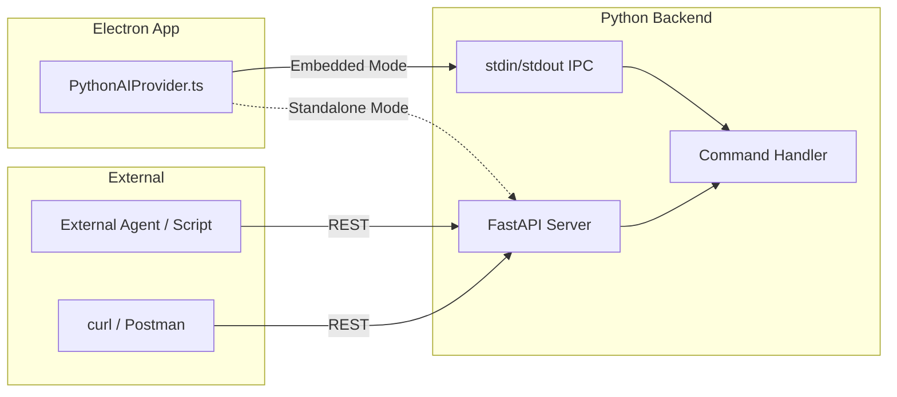

# Debug API with External Agent API Groundwork

Implement a Debug API to accelerate face detection/recognition troubleshooting, while laying the architectural foundation for the full External Agent API planned in `future_features.md`.

## User Review Required

> [!IMPORTANT]
> **Dependency Choice:** This plan uses **FastAPI** for the REST layer. Alternatives considered:
> - Flask (simpler, but no async)
> - aiohttp (lower-level, more boilerplate)
> 
> FastAPI is recommended for: auto-generated OpenAPI docs, async support, Pydantic validation.

> [!WARNING]
> **Breaking Change:** The Python backend will need a new dependency (`fastapi`, `uvicorn`). This increases the bundled runtime size by ~5MB.

---

## Proposed Changes

### API Infrastructure (`src/python/api/`)

#### [NEW] [server.py](file:///j:/Projects/smart-photo-organizer/src/python/api/server.py)
FastAPI application setup with dual-mode support:
- **Standalone Mode:** Runs HTTP server on configurable port (default: 3001)
- **Embedded Mode:** Existing stdin/stdout JSON-line IPC (unchanged)

```python
# Startup detection
if os.environ.get('API_MODE') == 'http':
    uvicorn.run(app, host="0.0.0.0", port=int(os.environ.get('API_PORT', 3001)))
else:
    main_loop()  # Existing stdin IPC
```

#### [NEW] [routes/debug.py](file:///j:/Projects/smart-photo-organizer/src/python/api/routes/debug.py)
Debug-specific endpoints for face detection troubleshooting:

| Endpoint | Method | Description |
|----------|--------|-------------|
| `/api/v1/debug/detect-faces` | POST | Run detector, return raw boxes + NMS output |
| `/api/v1/debug/vlm-verify` | POST | Run VLM verification on a region |
| `/api/v1/debug/config` | GET | Return current AI config |
| `/api/v1/debug/config` | POST | Hot-reload config changes |
| `/api/v1/debug/nms-analysis` | POST | Return NMS before/after for an image |

#### [NEW] [routes/status.py](file:///j:/Projects/smart-photo-organizer/src/python/api/routes/status.py)
Production-ready endpoints (groundwork for full External Agent API):

| Endpoint | Method | Description |
|----------|--------|-------------|
| `/api/v1/status` | GET | Backend status (idle/scanning/queue depth) |
| `/api/v1/health` | GET | Health check (models loaded, GPU status, memory) |

#### [NEW] [middleware/auth.py](file:///j:/Projects/smart-photo-organizer/src/python/api/middleware/auth.py)
Optional API key authentication:
- Header: `X-API-Key: <key>`
- Key stored in `ai-config.json` under `api.key`
- Disabled by default for local development

---

### Configuration Changes

#### [MODIFY] [ai-config.json](file:///j:/Projects/smart-photo-organizer/ai-config.json)
Add API configuration section:

```diff
{
  "detection": { ... },
  "vlm": { ... },
+ "api": {
+   "enabled": false,
+   "port": 3001,
+   "key": null,
+   "allowedOrigins": ["http://localhost:5173"]
+ }
}
```

---

### Python Entry Point

#### [MODIFY] [main.py](file:///j:/Projects/smart-photo-organizer/src/python/main.py)
Add startup logic to choose between HTTP and IPC modes:

```diff
if __name__ == '__main__':
+   import os
+   if os.environ.get('API_MODE') == 'http':
+       from api.server import start_http_server
+       start_http_server()
+   else:
        try:
            main_loop()
        except Exception as e:
            ...
```

---

### TypeScript Integration

#### [MODIFY] [PythonAIProvider.ts](file:///j:/Projects/smart-photo-organizer/electron/infrastructure/PythonAIProvider.ts)
Add HTTP client fallback for standalone backend detection:

```diff
+ private httpFallbackEnabled = false;
+ private apiBaseUrl = 'http://localhost:3001';

  async sendRequest(type: string, payload: any, timeoutMs = 120000): Promise<any> {
+   // Check if standalone backend is running
+   if (this.httpFallbackEnabled) {
+     return this.sendHttpRequest(type, payload, timeoutMs);
+   }
    // Existing IPC logic...
  }

+ private async sendHttpRequest(type: string, payload: any, timeoutMs: number): Promise<any> {
+   const response = await fetch(`${this.apiBaseUrl}/api/v1/command`, {
+     method: 'POST',
+     headers: { 'Content-Type': 'application/json' },
+     body: JSON.stringify({ type, payload }),
+     signal: AbortSignal.timeout(timeoutMs)
+   });
+   return response.json();
+ }
```

---

### Dependencies

#### [MODIFY] [requirements.txt](file:///j:/Projects/smart-photo-organizer/src/python/requirements.txt)

```diff
+ fastapi>=0.109.0
+ uvicorn[standard]>=0.27.0
```

---

## Architecture Diagram



---

## Verification Plan

### Automated Tests

#### Unit Tests (Python)
Location: `tests/python/unit/test_api.py`

```powershell
# Run from project root
cd j:\Projects\smart-photo-organizer
python -m pytest tests/python/unit/test_api.py -v
```

Tests to add:
1. `test_detect_faces_endpoint_returns_raw_boxes`
2. `test_config_endpoint_returns_current_settings`
3. `test_auth_middleware_rejects_invalid_key`

#### Integration Tests
Location: `tests/python/integration/test_api_integration.py`

```powershell
# Start backend in HTTP mode, then run tests
$env:API_MODE = "http"
Start-Process python -ArgumentList "src/python/main.py" -NoNewWindow
Start-Sleep -Seconds 3
python -m pytest tests/python/integration/test_api_integration.py -v
```

### Manual Verification

1. **Start Backend in HTTP Mode:**
   ```powershell
   cd j:\Projects\smart-photo-organizer\src\python
   $env:API_MODE = "http"
   python main.py
   ```

2. **Test Debug Endpoint:**
   ```powershell
   $body = @{ imagePath = "J:/path/to/test/photo.jpg" } | ConvertTo-Json
   Invoke-RestMethod -Uri "http://localhost:3001/api/v1/debug/detect-faces" -Method POST -Body $body -ContentType "application/json"
   ```

3. **Verify OpenAPI Docs:**
   - Open `http://localhost:3001/docs` in browser
   - Should show auto-generated Swagger UI

4. **Test Config Hot-Reload:**
   ```powershell
   $config = @{ "nms" = @{ "iou_threshold" = 0.35 } } | ConvertTo-Json
   Invoke-RestMethod -Uri "http://localhost:3001/api/v1/debug/config" -Method POST -Body $config -ContentType "application/json"
   ```

---

## Risk Assessment

| Risk | Mitigation |
|------|------------|
| Existing IPC breaks | Keep IPC as default; HTTP is opt-in via `API_MODE` env var |
| Port conflicts | Configurable port in `ai-config.json` |
| Security (open port) | API key auth + localhost-only binding by default |
| Bundle size increase | FastAPI/uvicorn add ~5MB (acceptable) |

---

## Implementation Order

1. **Phase 1:** Create `api/` module structure + FastAPI setup (no endpoints yet)
2. **Phase 2:** Add debug endpoints (detect-faces, config, nms-analysis)
3. **Phase 3:** Add production endpoints (status, health)
4. **Phase 4:** TypeScript HTTP fallback integration
5. **Phase 5:** Tests + documentation
