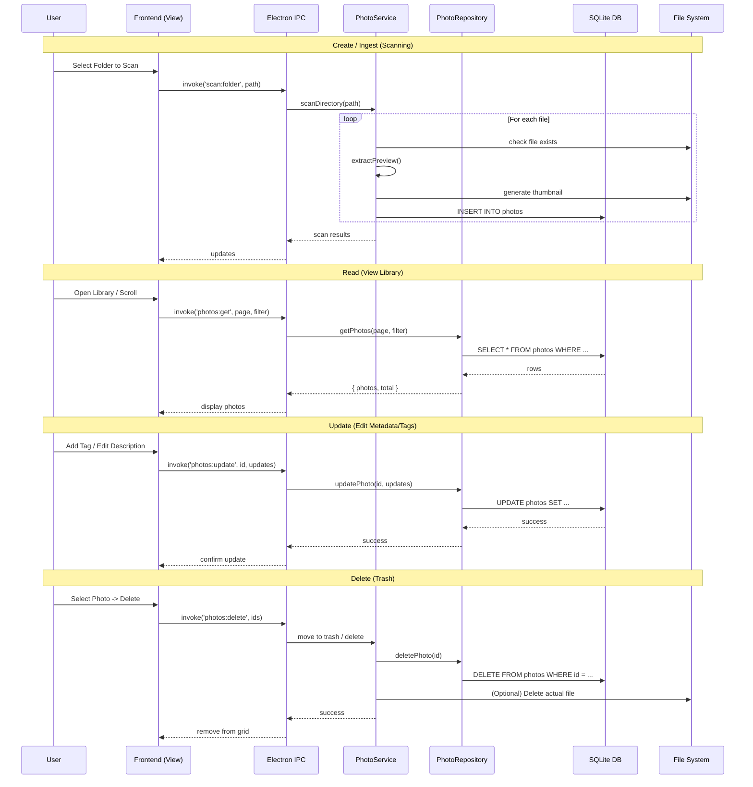

# CRUD Process Flow

```mermaid
sequenceDiagram
    participant User
    participant UI as Frontend (View)
    participant IPC as Electron IPC
    participant Service as PhotoService
    participant Repo as PhotoRepository
    participant DB as SQLite DB
    participant FS as File System

    %% CREATE (Scan/Ingest)
    Note over User, FS: Create / Ingest (Scanning)
    User->>UI: Select Folder to Scan
    UI->>IPC: invoke('scan:folder', path)
    IPC->>Service: scanDirectory(path)
    loop For each file
        Service->>FS: check file exists
        Service->>Service: extractPreview()
        Service->>FS: generate thumbnail
        Service->>DB: INSERT INTO photos
    end
    Service-->>IPC: scan results
    IPC-->>UI: updates

    %% READ
    Note over User, FS: Read (View Library)
    User->>UI: Open Library / Scroll
    UI->>IPC: invoke('photos:get', page, filter)
    IPC->>Repo: getPhotos(page, filter)
    Repo->>DB: SELECT * FROM photos WHERE ...
    DB-->>Repo: rows
    Repo-->>IPC: { photos, total }
    IPC-->>UI: display photos

    %% UPDATE
    Note over User, FS: Update (Edit Metadata/Tags)
    User->>UI: Add Tag / Edit Description
    UI->>IPC: invoke('photos:update', id, updates)
    IPC->>Repo: updatePhoto(id, updates)
    Repo->>DB: UPDATE photos SET ...
    DB-->>Repo: success
    Repo-->>IPC: success
    IPC-->>UI: confirm update

    %% DELETE
    Note over User, FS: Delete (Trash)
    User->>UI: Select Photo -> Delete
    UI->>IPC: invoke('photos:delete', ids)
    IPC->>Service: move to trash / delete
    Service->>Repo: deletePhoto(id)
    Repo->>DB: DELETE FROM photos WHERE id = ...
    Service->>FS: (Optional) Delete actual file
    Service-->>IPC: success
    IPC-->>UI: remove from grid
```
