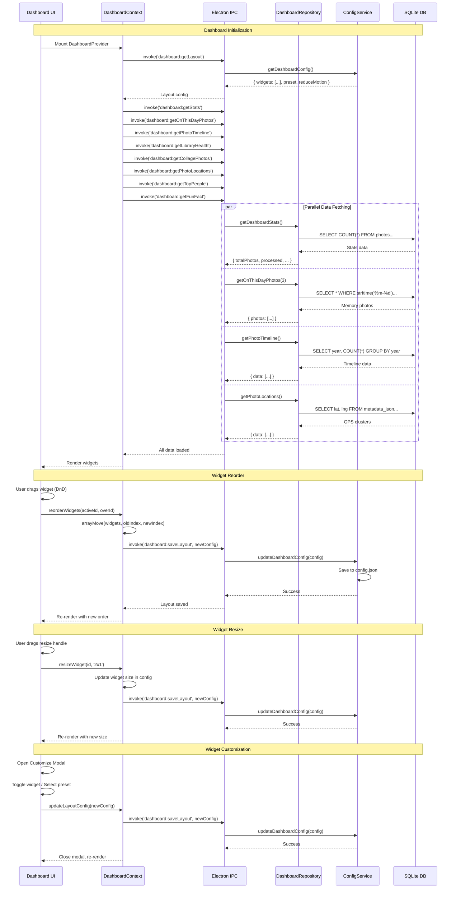

# Dashboard Widget Flow

```mermaid
sequenceDiagram
    participant UI as Dashboard UI
    participant Context as DashboardContext
    participant IPC as Electron IPC
    participant Repo as DashboardRepository
    participant Config as ConfigService
    participant DB as SQLite DB

    %% Initial Load
    Note over UI, DB: Dashboard Initialization
    UI->>Context: Mount DashboardProvider
    Context->>IPC: invoke('dashboard:getLayout')
    IPC->>Config: getDashboardConfig()
    Config-->>IPC: { widgets: [...], preset, reduceMotion }
    IPC-->>Context: Layout config
    
    Context->>IPC: invoke('dashboard:getStats')
    Context->>IPC: invoke('dashboard:getOnThisDayPhotos')
    Context->>IPC: invoke('dashboard:getPhotoTimeline')
    Context->>IPC: invoke('dashboard:getLibraryHealth')
    Context->>IPC: invoke('dashboard:getCollagePhotos')
    Context->>IPC: invoke('dashboard:getPhotoLocations')
    Context->>IPC: invoke('dashboard:getTopPeople')
    Context->>IPC: invoke('dashboard:getFunFact')
    
    par Parallel Data Fetching
        IPC->>Repo: getDashboardStats()
        Repo->>DB: SELECT COUNT(*) FROM photos...
        DB-->>Repo: Stats data
        Repo-->>IPC: { totalPhotos, processed, ... }
    and
        IPC->>Repo: getOnThisDayPhotos(3)
        Repo->>DB: SELECT * WHERE strftime('%m-%d')...
        DB-->>Repo: Memory photos
        Repo-->>IPC: { photos: [...] }
    and
        IPC->>Repo: getPhotoTimeline()
        Repo->>DB: SELECT year, COUNT(*) GROUP BY year
        DB-->>Repo: Timeline data
        Repo-->>IPC: { data: [...] }
    and
        IPC->>Repo: getPhotoLocations()
        Repo->>DB: SELECT lat, lng FROM metadata_json...
        DB-->>Repo: GPS clusters
        Repo-->>IPC: { data: [...] }
    end
    
    IPC-->>Context: All data loaded
    Context-->>UI: Render widgets

    %% Widget Reorder (Drag-and-Drop)
    Note over UI, DB: Widget Reorder
    UI->>UI: User drags widget (DnD)
    UI->>Context: reorderWidgets(activeId, overId)
    Context->>Context: arrayMove(widgets, oldIndex, newIndex)
    Context->>IPC: invoke('dashboard:saveLayout', newConfig)
    IPC->>Config: updateDashboardConfig(config)
    Config->>Config: Save to config.json
    Config-->>IPC: Success
    IPC-->>Context: Layout saved
    Context-->>UI: Re-render with new order

    %% Widget Resize
    Note over UI, DB: Widget Resize
    UI->>UI: User drags resize handle
    UI->>Context: resizeWidget(id, '2x1')
    Context->>Context: Update widget size in config
    Context->>IPC: invoke('dashboard:saveLayout', newConfig)
    IPC->>Config: updateDashboardConfig(config)
    Config-->>IPC: Success
    Context-->>UI: Re-render with new size

    %% Customization Modal
    Note over UI, DB: Widget Customization
    UI->>UI: Open Customize Modal
    UI->>UI: Toggle widget / Select preset
    UI->>Context: updateLayoutConfig(newConfig)
    Context->>IPC: invoke('dashboard:saveLayout', newConfig)
    IPC->>Config: updateDashboardConfig(config)
    Config-->>IPC: Success
    Context-->>UI: Close modal, re-render
```
