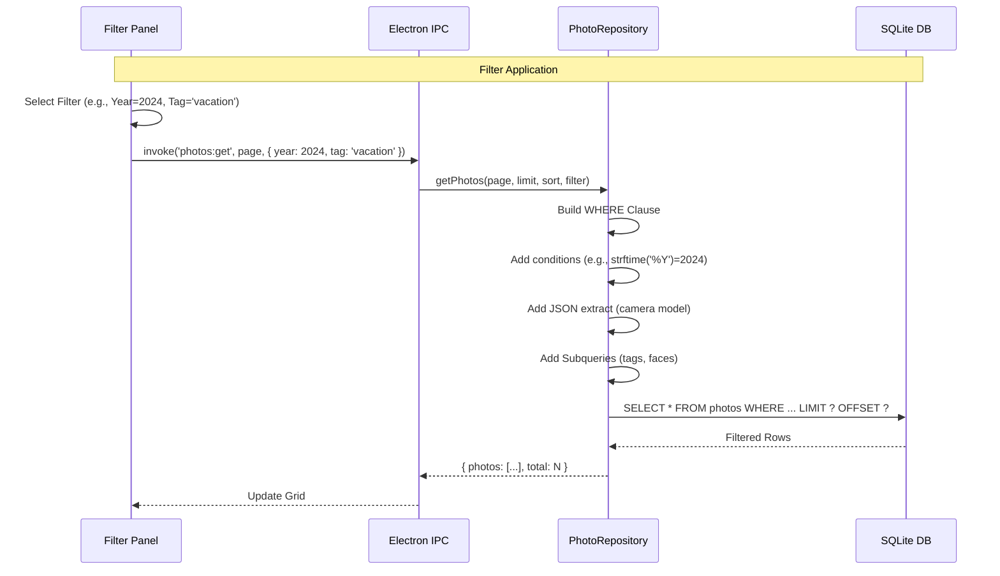

# Filtering Component Flow

```mermaid
sequenceDiagram
    participant UI as Filter Panel
    participant IPC as Electron IPC
    participant Repo as PhotoRepository
    participant DB as SQLite DB

    %% Apply Filters
    Note over UI, DB: Filter Application
    UI->>UI: Select Filter (e.g., Year=2024, Tag='vacation')
    UI->>IPC: invoke('photos:get', page, { year: 2024, tag: 'vacation' })
    IPC->>Repo: getPhotos(page, limit, sort, filter)
    
    Repo->>Repo: Build WHERE Clause
    Repo->>Repo: Add conditions (e.g., strftime('%Y')=2024)
    Repo->>Repo: Add JSON extract (camera model)
    Repo->>Repo: Add Subqueries (tags, faces)

    Repo->>DB: SELECT * FROM photos WHERE ... LIMIT ? OFFSET ?
    DB-->>Repo: Filtered Rows
    Repo-->>IPC: { photos: [...], total: N }
    IPC-->>UI: Update Grid
```
