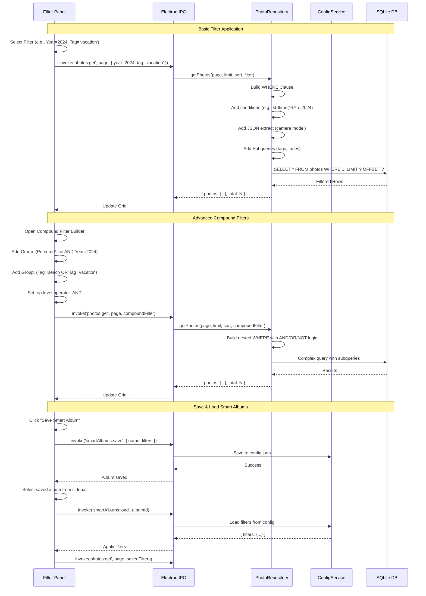

# Filtering Component Flow

```mermaid
sequenceDiagram
    participant UI as Filter Panel
    participant IPC as Electron IPC
    participant Repo as PhotoRepository
    participant Config as ConfigService
    participant DB as SQLite DB

    %% Apply Filters
    Note over UI, DB: Basic Filter Application
    UI->>UI: Select Filter (e.g., Year=2024, Tag='vacation')
    UI->>IPC: invoke('photos:get', page, { year: 2024, tag: 'vacation' })
    IPC->>Repo: getPhotos(page, limit, sort, filter)
    
    Repo->>Repo: Build WHERE Clause
    Repo->>Repo: Add conditions (e.g., strftime('%Y')=2024)
    Repo->>Repo: Add JSON extract (camera model)
    Repo->>Repo: Add Subqueries (tags, faces)

    Repo->>DB: SELECT * FROM photos WHERE ... LIMIT ? OFFSET ?
    DB-->>Repo: Filtered Rows
    Repo-->>IPC: { photos: [...], total: N }
    IPC-->>UI: Update Grid

    %% Compound Filter Builder (v0.6.5)
    Note over UI, DB: Advanced Compound Filters
    UI->>UI: Open Compound Filter Builder
    UI->>UI: Add Group: (Person=Alice AND Year=2024)
    UI->>UI: Add Group: (Tag=Beach OR Tag=Vacation)
    UI->>UI: Set top-level operator: AND
    UI->>IPC: invoke('photos:get', page, compoundFilter)
    IPC->>Repo: getPhotos(page, limit, sort, compoundFilter)
    Repo->>Repo: Build nested WHERE with AND/OR/NOT logic
    Repo->>DB: Complex query with subqueries
    DB-->>Repo: Results
    Repo-->>IPC: { photos: [...], total: N }
    IPC-->>UI: Update Grid

    %% Smart Albums (v0.6.5)
    Note over UI, DB: Save & Load Smart Albums
    UI->>UI: Click "Save Smart Album"
    UI->>IPC: invoke('smartAlbums:save', { name, filters })
    IPC->>Config: Save to config.json
    Config-->>IPC: Success
    IPC-->>UI: Album saved

    UI->>UI: Select saved album from sidebar
    UI->>IPC: invoke('smartAlbums:load', albumId)
    IPC->>Config: Load filters from config
    Config-->>IPC: { filters: {...} }
    IPC-->>UI: Apply filters
    UI->>IPC: invoke('photos:get', page, savedFilters)
```
