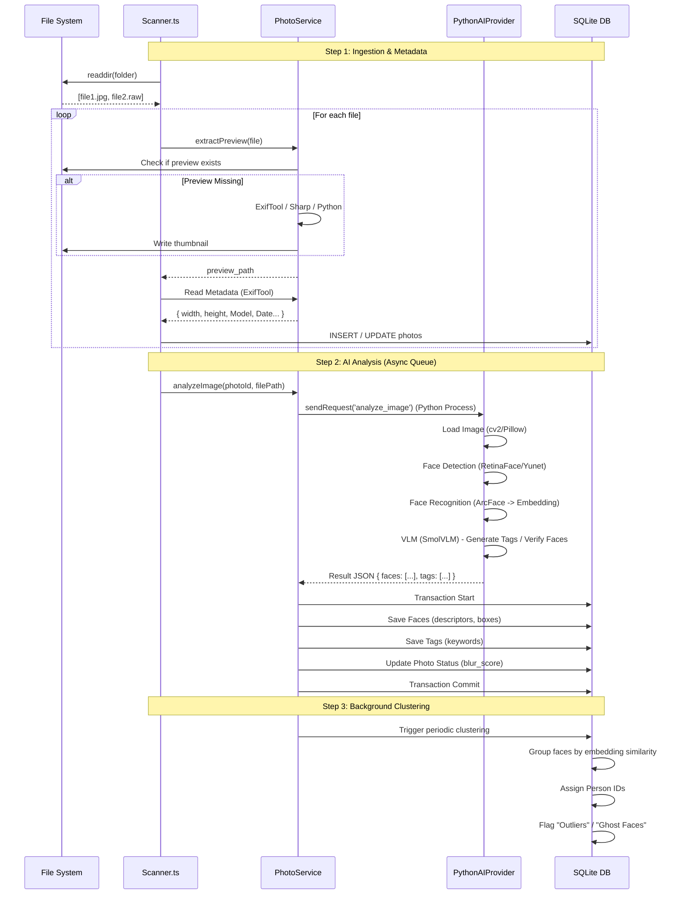

# Scanning & AI Analysis Flow

```mermaid
sequenceDiagram
    participant FS as File System
    participant Scanner as Scanner.ts
    participant Photo as PhotoService
    participant Python as PythonAIProvider
    participant DB as SQLite DB

    %% STEP 1: Discovery
    Note over Scanner, DB: Step 1: Ingestion & Metadata
    Scanner->>FS: readdir(folder)
    FS-->>Scanner: [file1.jpg, file2.raw]
    
    loop For each file
        Scanner->>Photo: extractPreview(file)
        Photo->>FS: Check if preview exists
        alt Preview Missing
            Photo->>Photo: ExifTool / Sharp / Python
            Photo->>FS: Write thumbnail
        end
        Photo-->>Scanner: preview_path

        Scanner->>Photo: Read Metadata (ExifTool)
        Photo-->>Scanner: { width, height, Model, Date... }
        Scanner->>DB: INSERT / UPDATE photos
    end

    %% STEP 2: AI Analysis
    Note over Scanner, DB: Step 2: AI Analysis (Async Queue)
    Scanner->>Photo: analyzeImage(photoId, filePath)
    Photo->>Python: sendRequest('analyze_image') (Python Process)

    Python->>Python: Load Image (cv2/Pillow)
    Python->>Python: Face Detection (RetinaFace/Yunet)
    Python->>Python: Face Recognition (ArcFace -> Embedding)
    Python->>Python: VLM (SmolVLM) - Generate Tags / Verify Faces
    
    Python-->>Photo: Result JSON { faces: [...], tags: [...] }
    
    Photo->>DB: Transaction Start
    Photo->>DB: Save Faces (descriptors, boxes)
    Photo->>DB: Save Tags (keywords)
    Photo->>DB: Update Photo Status (blur_score)
    Photo->>DB: Transaction Commit

    %% STEP 3: Clustering (Smart Ignore)
    Note over Scanner, DB: Step 3: Background Clustering
    Photo->>DB: Trigger periodic clustering
    DB->>DB: Group faces by embedding similarity
    DB->>DB: Assign Person IDs
    DB->>DB: Flag "Outliers" / "Ghost Faces"
```
