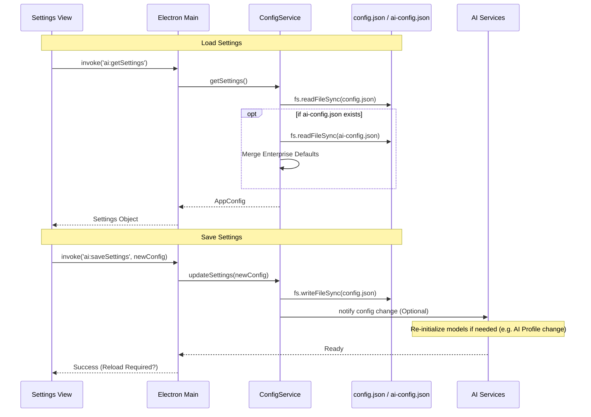
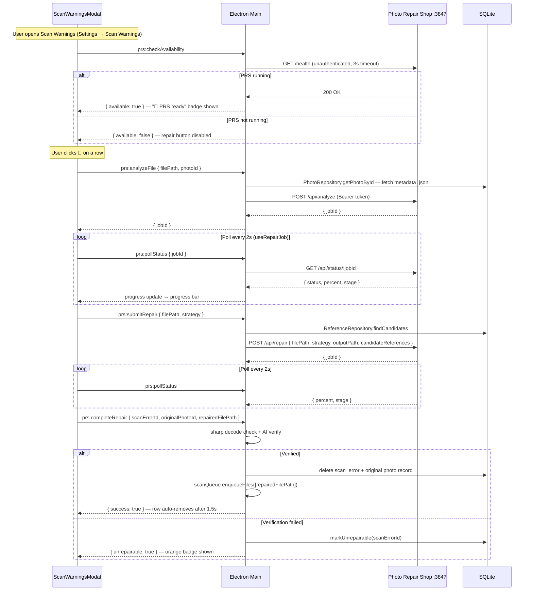

# Settings Flow

```mermaid
sequenceDiagram
    participant UI as Settings View
    participant IPC as Electron Main
    participant Config as ConfigService
    participant Disk as config.json / ai-config.json
    participant Service as AI Services

    %% READ Settings
    Note over UI, Disk: Load Settings
    UI->>IPC: invoke('ai:getSettings')
    IPC->>Config: getSettings()
    Config->>Disk: fs.readFileSync(config.json)
    opt if ai-config.json exists
        Config->>Disk: fs.readFileSync(ai-config.json)
        Config->>Config: Merge Enterprise Defaults
    end
    Config-->>IPC: AppConfig
    IPC-->>UI: Settings Object

    %% UPDATE Settings
    Note over UI, Disk: Save Settings
    UI->>IPC: invoke('ai:saveSettings', newConfig)
    IPC->>Config: updateSettings(newConfig)
    Config->>Disk: fs.writeFileSync(config.json)
    
    %% APPLY Changes
    Config->>Service: notify config change (Optional)
    Note over Service: Re-initialize models if needed (e.g. AI Profile change)
    Service-->>IPC: Ready
    IPC-->>UI: Success (Reload Required?)
```

# Scan Warnings → PRS Repair Flow

```mermaid
sequenceDiagram
    participant UI as ScanWarningsModal
    participant IPC as Electron Main
    participant PRS as Photo Repair Shop :3847
    participant DB as SQLite

    Note over UI: User opens Scan Warnings (Settings → Scan Warnings)
    UI->>IPC: prs:checkAvailability
    IPC->>PRS: GET /health (unauthenticated, 3s timeout)
    alt PRS running
        PRS-->>IPC: 200 OK
        IPC-->>UI: { available: true } — "🔧 PRS ready" badge shown
    else PRS not running
        IPC-->>UI: { available: false } — repair button disabled
    end

    Note over UI: User clicks 🔧 on a row
    UI->>IPC: prs:analyzeFile { filePath, photoId }
    IPC->>DB: PhotoRepository.getPhotoById — fetch metadata_json
    IPC->>PRS: POST /api/analyze (Bearer token)
    PRS-->>IPC: { jobId }
    IPC-->>UI: { jobId }

    loop Poll every 2s (useRepairJob)
        UI->>IPC: prs:pollStatus { jobId }
        IPC->>PRS: GET /api/status/:jobId
        PRS-->>IPC: { status, percent, stage }
        IPC-->>UI: progress update → progress bar
    end

    UI->>IPC: prs:submitRepair { filePath, strategy }
    IPC->>DB: ReferenceRepository.findCandidates
    IPC->>PRS: POST /api/repair { filePath, strategy, outputPath, candidateReferences }
    PRS-->>IPC: { jobId }

    loop Poll every 2s
        UI->>IPC: prs:pollStatus
        PRS-->>IPC: { percent, stage }
    end

    UI->>IPC: prs:completeRepair { scanErrorId, originalPhotoId, repairedFilePath }
    IPC->>IPC: sharp decode check + AI verify
    alt Verified
        IPC->>DB: delete scan_error + original photo record
        IPC->>IPC: scanQueue.enqueueFiles([repairedFilePath])
        IPC-->>UI: { success: true } — row auto-removes after 1.5s
    else Verification failed
        IPC->>DB: markUnrepairable(scanErrorId)
        IPC-->>UI: { unrepairable: true } — orange badge shown
    end
```
