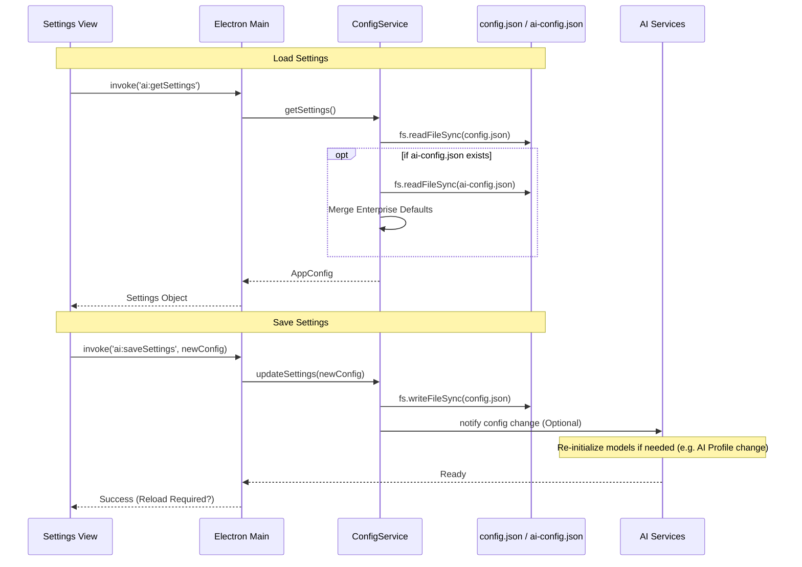

# Settings Flow

```mermaid
sequenceDiagram
    participant UI as Settings View
    participant IPC as Electron Main
    participant Config as ConfigService
    participant Disk as config.json / ai-config.json
    participant Service as AI Services

    %% READ Settings
    Note over UI, Disk: Load Settings
    UI->>IPC: invoke('ai:getSettings')
    IPC->>Config: getSettings()
    Config->>Disk: fs.readFileSync(config.json)
    opt if ai-config.json exists
        Config->>Disk: fs.readFileSync(ai-config.json)
        Config->>Config: Merge Enterprise Defaults
    end
    Config-->>IPC: AppConfig
    IPC-->>UI: Settings Object

    %% UPDATE Settings
    Note over UI, Disk: Save Settings
    UI->>IPC: invoke('ai:saveSettings', newConfig)
    IPC->>Config: updateSettings(newConfig)
    Config->>Disk: fs.writeFileSync(config.json)
    
    %% APPLY Changes
    Config->>Service: notify config change (Optional)
    Note over Service: Re-initialize models if needed (e.g. AI Profile change)
    Service-->>IPC: Ready
    IPC-->>UI: Success (Reload Required?)
```
