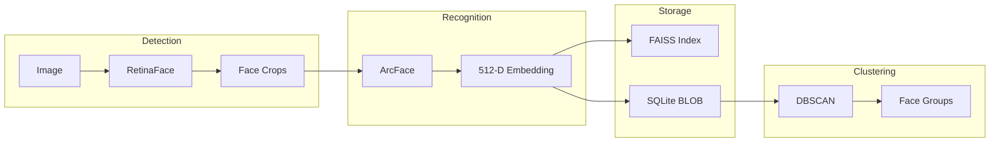

# Face Recognition Technology Stack

This document describes the AI/ML technologies powering the Smart Photo Organizer's face detection, recognition, and clustering pipeline. It serves as a technical reference and future improvement roadmap.

---

## Current Implementation

### Core Pipeline



### Technology Stack

| Component | Library | Model | Purpose |
|-----------|---------|-------|---------|
| **Detection** | InsightFace | RetinaFace (buffalo_l) | Locate faces in images, handles occlusions and angles |
| **Recognition** | InsightFace | ArcFace (buffalo_l) | Generate 512-D face embeddings for identity matching |
| **Age/Gender** | InsightFace | GenderAge module | Extract estimated age and gender from faces |
| **Vector Search** | FAISS | IndexFlatL2 | Fast similarity search across all named face embeddings |
| **Clustering** | scikit-learn | DBSCAN | Group similar unnamed faces by embedding distance |
| **Database** | SQLite | - | Store face metadata, embeddings (BLOB), and relationships |

### Why This Stack?

1. **InsightFace (RetinaFace + ArcFace)**
   - State-of-the-art for "in-the-wild" face analysis
   - RetinaFace uses a feature pyramid network and deformable convolutions for **pose-invariant detection**
   - ArcFace uses **Additive Angular Margin Loss** which enforces better separation between identities in embedding space
   - Handles side profiles, occlusions, and extreme angles better than older models (MTCNN, Haar Cascades)

2. **FAISS**
   - Industry standard for high-performance vector similarity search
   - Supports GPU acceleration
   - Handles 50,000+ face vectors efficiently

3. **DBSCAN Clustering**
   - Density-based clustering that doesn't require specifying number of clusters
   - Naturally identifies "noise" points (singleton faces that don't belong to any group)
   - Works well with normalized cosine distances

---

## Research: Libraries & Models Evaluated

### Face Detection & Recognition

| Library | Use Case | Notes |
|---------|----------|-------|
| **InsightFace** ✅ | State-of-the-art detection + recognition | **Currently in use.** ArcFace embeddings are superior for pose variance |
| **MediaPipe BlazeFace** | Ultra-fast detection (mobile) | 200-1000+ FPS; better for real-time video than batch photo processing |
| **OpenFace** | Landmark detection, pose estimation | InsightFace includes similar functionality internally |
| **Dlib** | Classical HOG/SVM detection | Older but stable; less accurate for hard poses |
| **DSFD** | Pose-invariant detection | Research-grade; similar robustness to RetinaFace |

### Vector Storage & Search

| Library | Use Case | Notes |
|---------|----------|-------|
| **FAISS** ✅ | Billion-scale vector search | **Currently in use.** Industry standard from Meta |
| **ScaNN** | Google's vector search | Powers Google Photos; slightly faster for MIPS |
| **Milvus Lite** | Embedded vector DB | Provides hybrid search (metadata + vector) but adds dependency |

### Image Quality Analysis

| Library | Use Case | Notes |
|---------|----------|-------|
| **OpenCV** | Laplacian variance blur detection | Simple, fast, well-understood |
| **PyIQA** | Deep learning quality scoring | BRISQUE/NIQE correlate better with human perception |
| **scikit-image** | Texture analysis (Shannon entropy) | Distinguishes smooth textures from blur artifacts |

### Semantic Tagging

| Library | Use Case | Notes |
|---------|----------|-------|
| **SmolVLM2** ✅ | Local image captioning | **Currently in use.** Lightweight VLM for descriptions |
| **Tag2Text** | Zero-shot image tagging | Superior tag recognition but larger model |
| **YOLOv8/YOLO-World** | Object detection | Structured tags with bounding boxes ("3 dogs", "1 car") |

---

## Handling Difficult Face Profiles

Standard face recognition struggles with **extreme poses** (side profiles, top-down views, severe rotations). The research identifies several strategies to improve accuracy:

### 1. Pose Scoring & Filtering

InsightFace provides head pose angles (`face.pose`) containing **yaw**, **pitch**, and **roll**:

```python
for face in detected_faces:
    yaw, pitch, roll = face.pose
    # yaw > 45° = side profile
    # pitch > 30° = looking up/down
    # roll > 30° = tilted head
```

**Strategy:**
- Store pose data in the database for future filtering
- Flag faces with extreme angles (yaw > 45°) as "side_profile"
- Use lower confidence for embeddings from extreme poses
- Prioritize frontal faces for centroid calculation

### 2. Contextual Identity Propagation

When visual recognition fails (top-down views, back of head), use **photo context**:

```
Photo A (12:00 PM, GPS: Home) → Clear frontal face of "Mom"
Photo B (12:01 PM, GPS: Home) → Top-down/unclear face

Logic: Assume Photo B also contains "Mom" based on temporal/spatial proximity
```

**Implementation Approach:**
- Use existing `session_folder` and `session_date` metadata
- Calculate time proximity: |tᵢ - tⱼ| < 5 minutes
- Propagate high-confidence labels to temporally adjacent hard cases

### 3. 3D Alignment & Frontalization

**Advanced (Future Consideration):**
- Use 3D pose estimation to mathematically "rotate" a side-profile face to frontal view
- Requires GAN-based frontalization models
- High implementation complexity; contextual propagation is simpler

### 4. Part-Based Recognition

Instead of treating the face as a single global feature:
- Learn fine-grained local features (ear shape, nose bridge, hairline)
- If one region is occluded, match on visible regions
- Implemented via attention mechanisms in advanced models

> [!NOTE]
> Phase 23 ("Challenging Face Recognition") already implements **pose-aware matching** and **multi-sample voting** which partially addresses this.

---

## Recommended Improvements (Roadmap)

### High Priority

1. **Expose Pose Data**
   - Store `face.pose` (yaw/pitch/roll) during scan
   - Add `pose_yaw`, `pose_pitch`, `pose_roll` columns to faces table
   - Enable filtering by pose in UI ("Show only frontal faces")

2. **Contextual Label Propagation**
   - New service: `ContextualMatchingService`
   - Use time/location clustering to propagate labels to hard faces
   - UI indicator: "Assigned via temporal context"

3. **Laplacian Blur Scoring**
   - Already have `blur_score` column
   - Enhance with OpenCV Laplacian variance during scan
   - Auto-flag extremely blurry faces for review

### Medium Priority

4. **Centroid Quality Weighting**
   - Weight frontal, sharp faces higher in centroid calculation
   - Reduce influence of extreme poses on person model

5. **Multi-Centroid Per-Era**
   - Store separate embeddings for frontal vs. profile views per era
   - Match incoming faces against most appropriate centroid

### Lower Priority (Deferred)

6. **ScaNN Integration**
   - Evaluate performance gains for 100K+ face libraries
   - Currently FAISS IndexFlatL2 is sufficient

7. **3D Frontalization**
   - GAN-based face rotation
   - Very high complexity; contextual matching is simpler

---

## Performance Characteristics

| Operation | Typical Time | Hardware |
|-----------|--------------|----------|
| Face Detection (RetinaFace) | 50-200ms/image | GPU |
| Face Embedding (ArcFace) | 5-20ms/face | GPU |
| GenderAge Extraction | 5-10ms/face | GPU |
| FAISS Search (50K vectors) | <10ms | CPU |
| DBSCAN Clustering (5K faces) | 100-500ms | CPU |

> [!TIP]
> The GenderAge module adds ~5-10% overhead to face detection but enables age-based ERA categorization.

---

## References

- [InsightFace GitHub](https://github.com/deepinsight/insightface)
- [ArcFace Paper](https://arxiv.org/abs/1801.07698) - Additive Angular Margin Loss
- [RetinaFace Paper](https://arxiv.org/abs/1905.00641) - Feature Pyramid Detection
- [FAISS Wiki](https://github.com/facebookresearch/faiss/wiki)
- [DBSCAN Algorithm](https://scikit-learn.org/stable/modules/clustering.html#dbscan)
