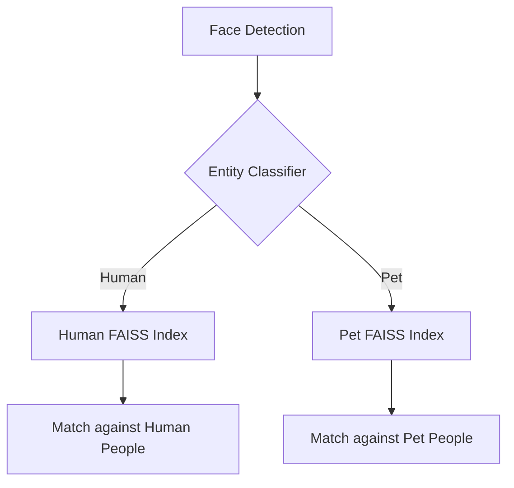

# Pet Face Recognition: Preventing Cross-Assignment

## Problem Statement

The current face detection system uses InsightFace (Buffalo_L model), which is trained on **human faces**. However, it occasionally detects pet faces (especially dogs with forward-facing eyes) as "faces" and generates embeddings for them.

**Root Issue:** When a pet face embedding is close enough in L2 distance to a human's centroid, it gets auto-assigned to that person. This causes "pollution" of human face datasets with pet photos.

**User Goal:** Support tagging both humans AND pets, but never cross-contaminate the two.

---

## Proposed Solution: Entity Type Classification

### Core Concept

Add an `entity_type` field to distinguish between:
- `human` - Default, person faces
- `pet_dog` / `pet_cat` - Animal faces  
- `unknown` - Unclassified detections or low-confidence results

### Architecture Design

### 1. The "Landmark Confidence" Filter (Phase 1)
True human faces have high landmark placement accuracy in the Buffalo_L model. Pet faces often fail landmark detection or return lower confidence scores.
- **Action:** Mark faces with low landmark confidence as `entity_type: unknown` and skip auto-assignment to human centroids.

### 2. Separate Matching Pools (Phase 2)
- **Constraint:** Humans can ONLY match humans. Pets can ONLY match pets.
- This prevents cross-assignment entirely even if the embeddings are mathematically close.

---

## Implementation Roadmap

### Phase 1: Schema & Backend
- [ ] **Database Migration:** Add `entity_type` column to `people` and `faces` tables.
- [ ] **Python Classifier:** Implement landmark confidence scoring in `main.py`.
- [ ] **Logic Update:** Modify `FaceService.ts` to filter matching by `entity_type`.

### Phase 2: UI & UX
- [ ] **Naming Modal:** Add "Entity Type" selector (Person vs Dog vs Cat).
- [ ] **People View:** Add badges or filters to separate humans from pets.
- [ ] **Outlier Review:** Specifically flag "Low-Confidence" faces detected as human for review.

---

## Current Status
- **Plan:** Drafted
- **Status:** Awaiting implementation
- **Priority:** Medium
