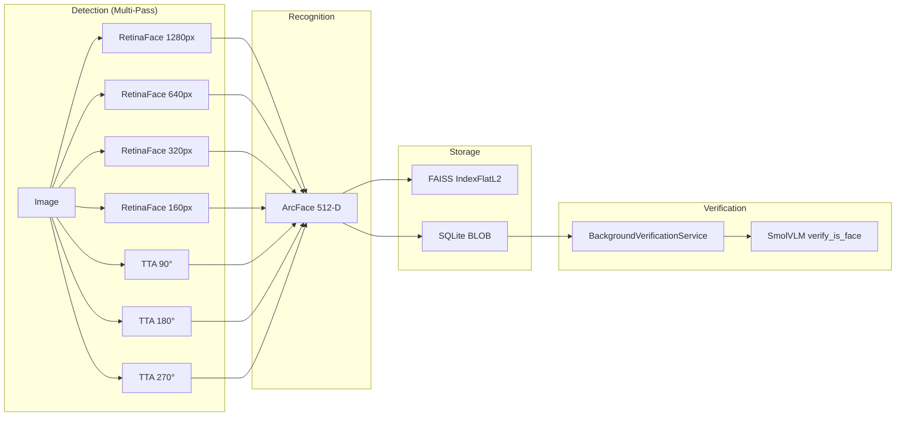

# VLM Accuracy & ML Research Review

**Date**: 2026-02-01  
**Status**: Research Complete | Awaiting Implementation Approval  
**Authors**: Sr. Software Engineer / Sr. ML Engineer Review

---

## Executive Summary

This document captures a comprehensive senior engineer analysis of latest open-source vision model research and how it applies to the Smart Photo Organizer's VLM accuracy and scanning performance.

**Key Findings**:
1. **SmolVLM cannot count faces** — use face detector instead of VLM for multi-face box splitting
2. **AdaFace outperforms ArcFace** on low-quality/blurry images — direct opportunity for improvement
3. **FAISS IndexFlatL2 won't scale** to 500K+ faces — migrate to IVF index or Milvus Lite
4. **7s/photo bottleneck** rooted in multi-pass detection (7 inference passes per image in MACRO mode)

---

## Current Architecture Assessment

### Face Detection & Recognition Pipeline



### Current Model Stack

| Component | Implementation | Performance | Limitation |
|-----------|---------------|-------------|------------|
| **Detection** | InsightFace RetinaFace (buffalo_l) | 50-200ms/pass | 7 passes in MACRO mode |
| **Recognition** | InsightFace ArcFace (buffalo_l) | 5-20ms/face | Weak on blurry/profile faces |
| **VLM** | SmolVLM-Instruct | ~500ms/face | Cannot count faces accurately |
| **Vector Search** | FAISS IndexFlatL2 | O(n) brute-force | Won't scale to 500K+ |
| **Clustering** | scikit-learn DBSCAN | 100-500ms | Adequate |

### Performance Breakdown (MACRO Mode, ~7s/photo)

| Stage | Time | % of Total |
|-------|------|------------|
| Image Loading | 200-500ms | 5% |
| **Detection (7 passes)** | 3500-4000ms | **55%** |
| Embedding Extraction | 500-1000ms | 12% |
| NMS Filtering | 50-100ms | 1% |
| VLM Tagging (if enabled) | 1500-2000ms | 25% |
| IPC Overhead | 100-200ms | 2% |

---

## Research Model Evaluation

### 1. SmolVLM for Face Verification

> **Current Role**: Verify "Is this a face or a knee?"  
> **Issue**: Cannot reliably count faces in cropped regions

**Evidence from Phase 57**:
```
VLM Multi-Face Detection: SmolVLM cannot reliably count faces in cropped regions. 
Even with explicit prompts, it reports face_count: "one" with reason 
"the two people are looking at each other".
```

**Recommendation**: 🔴 **Replace VLM face counting with detector re-run**

| Task | Use VLM | Use Detector |
|------|---------|--------------|
| "Is this a knee or a face?" | ✅ Yes | ❌ No |
| "How many faces in this box?" | ❌ No | ✅ Yes |
| "What is this object?" | ✅ Yes | ❌ No |

### 2. AdaFace for Low-Quality Recognition

> **Opportunity**: Replace ArcFace with AdaFace for faces with `blur_score < 50`

**Research Claim**: *"AdaFace adapts the loss function based on image quality. It is particularly effective for recognizing low-resolution or blurry faces often found in candid family photos."*

**Current State**: 
- `blur_score` column exists but is only used for filtering, not weighting
- `facelib/adaface_embedding.py` exists — suggests prior exploration

**Recommendation**: 🟡 **Implement hybrid embedding selection**

```python
def get_embedding(face_crop, blur_score):
    if blur_score < 50:  # Low quality threshold
        return adaface_model.get_embedding(face_crop)
    else:
        return arcface_model.get_embedding(face_crop)  # Current
```

### 3. Object Detection (YOLO-World / RF-DETR)

> **Opportunity**: Add object detection for semantic tagging ("3 dogs", "beach scene")

| Model | Best For | VRAM | Speed |
|-------|----------|------|-------|
| **YOLO-World** | Open-vocab detection | ~4GB | Fast |
| **RF-DETR** | Highest accuracy, no NMS tuning | ~6GB | Medium |

**Recommendation**: 🟢 **Add to backlog** — New capability, not a bug fix

### 4. Vector Database Scaling

> **Issue**: FAISS IndexFlatL2 is O(n) brute-force search  
> **Target Scale**: 500K+ faces over decades of photos

**Current Implementation**:
```python
# vector_store.py line 33
index = faiss_lib.IndexFlatL2(512)  # Brute-force, no compression
```

**Scaling Options**:

| Solution | Scale | Search Time | Memory | Migration Effort |
|----------|-------|-------------|--------|-----------------|
| **FAISS IVF** | 1M+ | O(log n) | Moderate | Low |
| **FAISS HNSW** | 10M+ | O(log n) | High | Low |
| **Milvus Lite** | 10M+ | O(log n) | Moderate | Medium |
| **ScaNN** | 100M+ | O(log n) | Low | High |

**Recommendation**: 🟡 **Migrate to FAISS IVF with training**

```python
# Proposed change
d = 512
nlist = 256  # Number of clusters
quantizer = faiss.IndexFlatL2(d)
index = faiss.IndexIVFFlat(quantizer, d, nlist, faiss.METRIC_L2)
# Must train on sample before adding
index.train(sample_vectors)  
```

---

## Performance Optimization Opportunities

### 1. Reduce Detection Passes (High Impact)

**Current**: Up to 7 inference passes (4 scales + 3 rotations)

**Proposed**: Adaptive pass strategy

```python
# Early exit if high-confidence faces found at standard resolution
def adaptive_scan(img):
    faces_1280 = detect(img, size=1280)
    
    # If we found good faces, skip lower resolutions
    if all(f.det_score > 0.8 for f in faces_1280) and len(faces_1280) > 0:
        return faces_1280
    
    # Only fall back if needed
    faces_640 = detect(img, size=640)
    # ... continue cascade
```

**Estimated Savings**: 30-50% reduction in scan time for standard photos

### 2. ONNX Runtime + TensorRT Optimization

**Current**: Default ONNX execution providers

**Proposed**: Force TensorRT for detection model

```python
# faces.py - Priority order
providers = [
    'TensorrtExecutionProvider',
    'CUDAExecutionProvider', 
    'CPUExecutionProvider'
]
```

**Note**: TensorRT libraries already detected in current code (line 85-88)

**Estimated Savings**: 20-40% faster inference on NVIDIA GPUs

### 3. Batch Embedding Extraction

**Current**: Sequential embedding per face

**Proposed**: Batch faces to GPU

```python
# Instead of 1-by-1:
for face in faces:
    embedding = model.get(face)

# Batch:
embeddings = model.get_batch(faces)  # Single GPU transfer
```

**Estimated Savings**: 15-25% for photos with multiple faces

### 4. Pre-compute Multi-Scale Image Pyramid

**Current**: Each pass resizes full image

**Proposed**: Build pyramid once, reuse

```python
pyramid = [
    cv2.resize(img, (1280, 1280)),
    cv2.resize(img, (640, 640)),
    cv2.resize(img, (320, 320)),
]
# Reuse pyramid for each detection pass
```

**Estimated Savings**: 10-15% on image preprocessing

---

## Recommended Implementation Phases

### Phase 58: VLM Multi-Face Fix (Critical)

**Goal**: Replace VLM face counting with detector re-run

**Changes**:
1. Add `detect_faces_in_region()` function to `main.py`
2. Modify `verify_is_face()` workflow:
   - VLM → semantic verification only ("face vs knee")
   - Detector → count faces in cropped region
3. If `face_count > 1`, split box and re-process

### Phase 59: AdaFace Integration (High Priority)

**Goal**: Improve recognition on low-quality faces

**Changes**:
1. Benchmark AdaFace vs ArcFace on lowest blur_score faces
2. Implement `HybridEmbedder` class with adaptive selection
3. Add config option: `useAdaFaceForLowQuality: true`

### Phase 60: Vector Database Scaling (Medium Priority)

**Goal**: Prepare for 500K+ face library

**Changes**:
1. Migrate from `IndexFlatL2` to `IndexIVFFlat`
2. Add training step during index rebuild
3. Benchmark search latency at 100K, 250K, 500K scale

### Phase 61: Scan Performance Optimization (Medium Priority)

**Goal**: Reduce 7s/photo to 3-4s/photo

**Changes**:
1. Implement adaptive early-exit detection
2. Force TensorRT provider order
3. Add image pyramid caching
4. Batch embedding extraction

---

## Model Recommendations Summary

| Task | Recommended Model | Current | Change Priority |
|------|------------------|---------|-----------------|
| **Face Detection** | RetinaFace (current) | RetinaFace | ✅ Keep |
| **Face Recognition** | AdaFace (hybrid) | ArcFace | 🟡 Add |
| **VLM Semantic** | SmolVLM (current) | SmolVLM | ✅ Keep |
| **VLM Face Count** | RetinaFace re-run | SmolVLM | 🔴 Replace |
| **Vector Search** | FAISS IVF | IndexFlatL2 | 🟡 Migrate |
| **Object Detection** | YOLO-World | None | 🟢 Backlog |

---

## References

- [SmolVLM2 Paper](https://huggingface.co/HuggingFaceTB/SmolVLM2-2.2B-Instruct)
- [AdaFace Paper](https://arxiv.org/abs/2204.00964)
- [RF-DETR Paper](https://blog.roboflow.com/rf-detr/)
- [FAISS IVF Documentation](https://github.com/facebookresearch/faiss/wiki/Faiss-indexes)
- [Milvus Lite](https://milvus.io/docs/milvus_lite.md)
