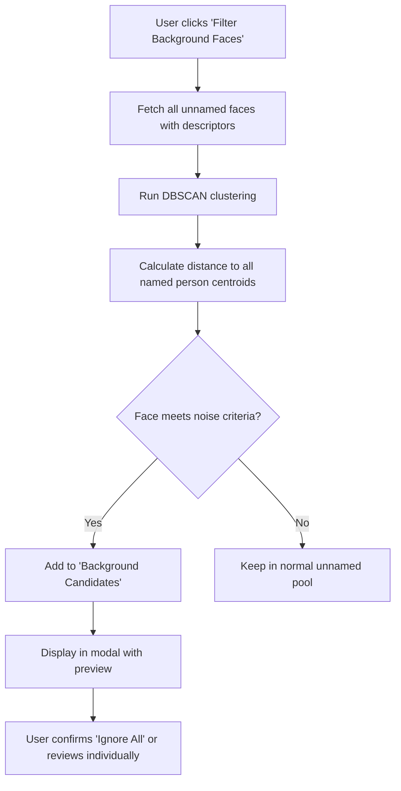
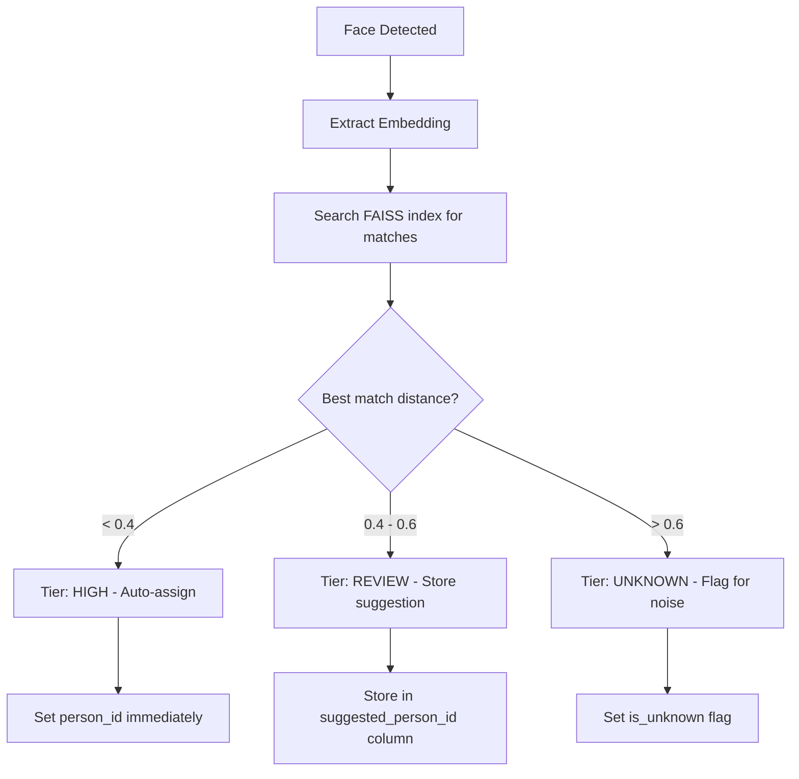
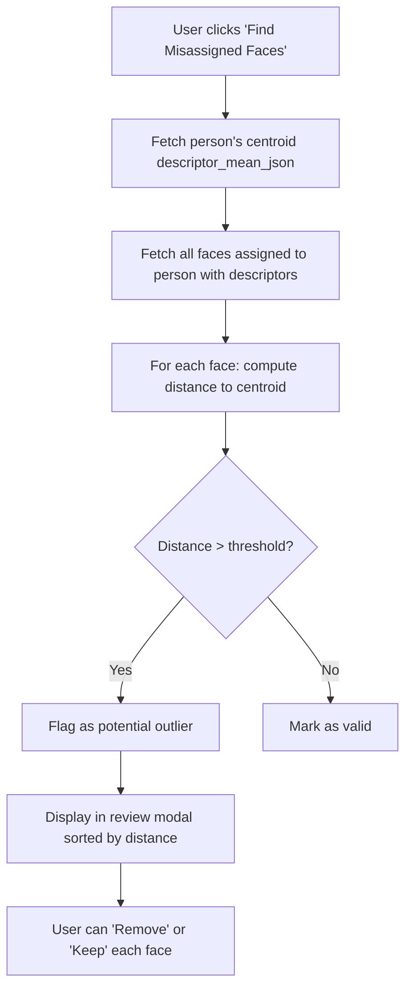
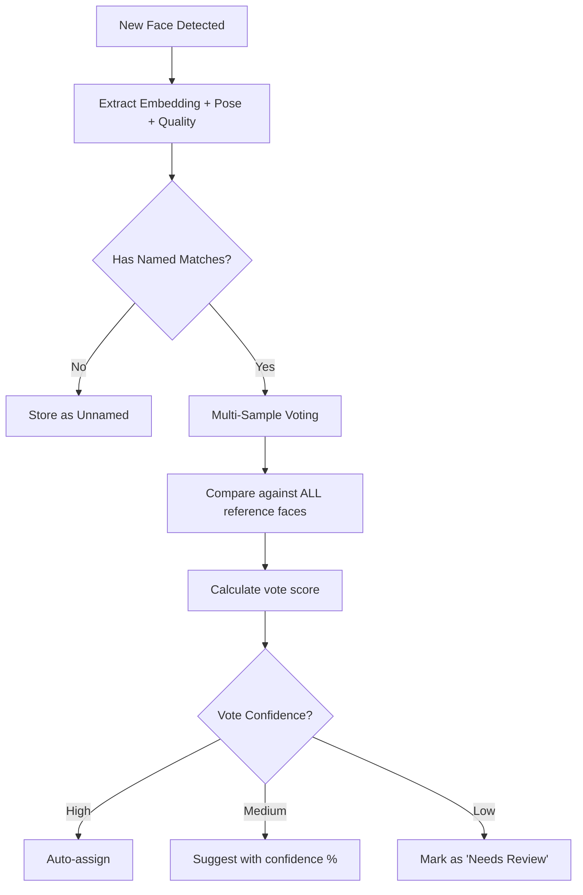
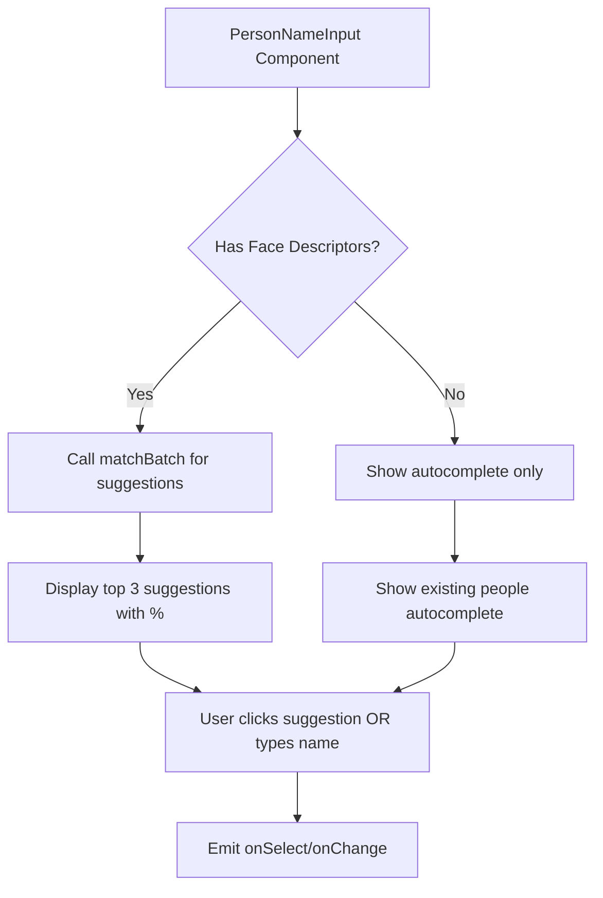

# Smart Face Ignore Optimization - Implementation Plan

> **Document Purpose:** Detailed technical specification for implementing intelligent face ignore features to reduce user burden when managing unwanted faces in the photo library.

## Problem Statement

In large photo libraries, users encounter many "noise" faces:
- Background strangers in street photos
- Crowds at events
- One-time appearances (waiters, passersby, etc.)

Currently, users must manually select and ignore each face or group. This becomes tedious for libraries with thousands of unnamed faces.

## Proposed Solution

Implement a six-tier intelligent face management system:
1. **Background Face Filter** - Bulk noise detection and removal
2. **Scan-Time Confidence Tiering** - Automatic classification at import
3. **Smart Ignore UI Panel** - Unified management dashboard
4. **Misassigned Face Detection** - Identify incorrectly assigned faces on named person pages
5. **Challenging Face Recognition** - Improved matching for side profiles, partial faces, and occlusions
6. **Unified Person Name Input** - Standardize AI-powered name suggestions across all face assignment interfaces

---

## Data Migration Strategy

> [!IMPORTANT]
> Several features in this plan add new database columns. Existing installations must be upgraded gracefully without data loss.

### Current Migration Pattern

The app uses `ALTER TABLE ... ADD COLUMN` statements wrapped in try/catch in `db.ts`:
```typescript
try {
    db.exec('ALTER TABLE faces ADD COLUMN new_column TYPE');
} catch (e) {
    // Column already exists - ignore
}
```

### New Schema Changes Summary

| Feature | Table | New Columns | Default Value | Backfill Required? |
|---------|-------|-------------|---------------|-------------------|
| Feature 2 | `faces` | `confidence_tier` | `'unknown'` | Yes - recalculate |
| Feature 2 | `faces` | `suggested_person_id` | `NULL` | No |
| Feature 2 | `faces` | `match_distance` | `NULL` | Yes - recalculate |
| Feature 5 | `faces` | `pose_yaw` | `NULL` | Yes - rescan |
| Feature 5 | `faces` | `pose_pitch` | `NULL` | Yes - rescan |
| Feature 5 | `faces` | `pose_roll` | `NULL` | Yes - rescan |
| Feature 5 | `faces` | `face_quality` | `NULL` | Yes - rescan |

### Migration Implementation

#### [MODIFY] [db.ts](file:///j:/Projects/smart-photo-organizer/electron/db.ts)

Add new column migrations:
```typescript
// --- MIGRATION: Scan-Time Confidence Tiering (Feature 2) ---
try {
    db.exec("ALTER TABLE faces ADD COLUMN confidence_tier TEXT DEFAULT 'unknown'");
} catch (e) { /* Column exists */ }

try {
    db.exec('ALTER TABLE faces ADD COLUMN suggested_person_id INTEGER');
} catch (e) { /* Column exists */ }

try {
    db.exec('ALTER TABLE faces ADD COLUMN match_distance REAL');
} catch (e) { /* Column exists */ }

// --- MIGRATION: Challenging Face Recognition (Feature 5) ---
try {
    db.exec('ALTER TABLE faces ADD COLUMN pose_yaw REAL');
} catch (e) { /* Column exists */ }

try {
    db.exec('ALTER TABLE faces ADD COLUMN pose_pitch REAL');
} catch (e) { /* Column exists */ }

try {
    db.exec('ALTER TABLE faces ADD COLUMN pose_roll REAL');
} catch (e) { /* Column exists */ }

try {
    db.exec('ALTER TABLE faces ADD COLUMN face_quality REAL');
} catch (e) { /* Column exists */ }
```

### Backfill Strategy for Existing Data

#### Option A: "Lazy Backfill" (Recommended for pose data)
- **When**: During next AI scan of each photo
- **How**: If `pose_yaw IS NULL`, re-extract full face data including pose
- **Pros**: No upfront cost, spreads work over time
- **Cons**: Inconsistent data until full rescan

```typescript
// In Python main.py analyze_image handler:
if face.pose_yaw is None:
    # Existing face but missing pose - regenerate
    new_data = extract_pose_and_quality(face)
    emit_update('face:updatePoseData', { faceId, ...new_data })
```

#### Option B: "Upgrade Wizard" (For confidence tiers)
- **When**: On app startup if migration detected
- **How**: Show modal offering "Upgrade Face Database"
- **Pros**: Clean, immediate, user-controlled
- **Cons**: Can be slow for large libraries

```typescript
// Check if migration needed
const needsUpgrade = db.prepare(`
    SELECT COUNT(*) as count FROM faces 
    WHERE confidence_tier IS NULL OR confidence_tier = 'unknown'
`).get();

if (needsUpgrade.count > 0) {
    // Show upgrade modal
    mainWindow.webContents.send('db:migrationAvailable', {
        feature: 'Confidence Tiering',
        facesAffected: needsUpgrade.count,
        estimatedTime: Math.ceil(needsUpgrade.count / 100) // ~100 faces/sec
    });
}
```

#### Option C: "Background Backfill"
- **When**: Idle time after app startup
- **How**: Background worker processes faces in batches
- **Pros**: Non-blocking, eventual consistency
- **Cons**: Complex state management

### UI for Migration Progress

#### [NEW] [DatabaseUpgradeModal.tsx](file:///j:/Projects/smart-photo-organizer/src/components/modals/DatabaseUpgradeModal.tsx)

Modal shown when schema migration requires data backfill:
- Progress bar with percentage
- "Pause" / "Resume" buttons
- "Skip for Now" option (data will be backfilled on next scan)
- Estimated time remaining

### Rollback Considerations

> [!CAUTION]
> New columns are added but never removed. This ensures forward compatibility. If a user downgrades:
> - Old app versions will ignore unknown columns (SQLite behavior)
> - Data in new columns is preserved but unused
> - No explicit rollback mechanism needed

### Testing Migration

1. Create backup of production `library.db`
2. Run app with backup - verify migration completes
3. Verify all new columns exist with expected defaults
4. Verify existing data is intact
5. Test incremental backfill during scan

---

## Feature 1: Background Face Filter (✅ Implemented)

### Overview

A post-scan analysis tool that identifies and groups "likely background" faces for bulk ignore actions.

### Technical Architecture



### Noise Detection Logic

A face is classified as "likely background noise" if it meets ALL of the following criteria:

| Criterion | Threshold | Rationale |
|-----------|-----------|-----------|
| Appearance frequency | ≤ 2 photos | One-time appearances are unlikely to be important |
| Cluster size | ≤ 2 faces (or singleton) | No recurring pattern |
| Distance to nearest named centroid | > 0.7 (normalized L2) | Not similar to any known person |
| Cluster isolation | Not within 0.5 of any other large cluster | Truly isolated in embedding space |

### Database Changes

#### [MODIFY] [db.ts](file:///j:/Projects/smart-photo-organizer/electron/db.ts)

No schema changes required. Use existing `is_ignored` column.

### Backend Changes

#### [NEW] [FaceAnalysisService.ts](file:///j:/Projects/smart-photo-organizer/electron/core/services/FaceAnalysisService.ts)

A unified service for all distance-based face analysis, used by both Background Face Filter and Misassigned Face Detection.

```typescript
interface NoiseCandidate {
    faceId: number;
    photoCount: number;
    clusterSize: number;
    nearestPersonDistance: number;
    nearestPersonName: string | null;
}

interface OutlierCandidate {
    faceId: number;
    distance: number;  // Distance from person's centroid
}

class FaceAnalysisService {
    // === Utility Methods (Shared) ===
    
    /**
     * Computes Euclidean distance between two L2-normalized descriptors.
     * Returns value in [0, 2] range (0 = identical, 2 = opposite).
     */
    static computeDistance(descriptorA: number[], descriptorB: number[]): number;
    
    // === Background Face Filter Methods ===
    
    // Main entry point for noise detection
    static async detectBackgroundFaces(): Promise<NoiseCandidate[]>;
    
    // Get photo appearance count for each face
    private static getPhotoFrequency(faceIds: number[]): Map<number, number>;
    
    // Calculate distance to all person centroids
    private static calculateCentroidDistances(descriptors: Float32Array[]): Map<number, {distance: number, personName: string | null}>;
    
    // === Misassigned Face Detection Methods ===
    
    /**
     * Finds faces assigned to a person that may be incorrectly assigned.
     * @param personId - The person to analyze
     * @param threshold - Distance threshold (default: 0.6)
     * @returns Array of outlier candidates sorted by distance (highest first)
     */
    static async findOutliersForPerson(personId: number, threshold?: number): Promise<OutlierCandidate[]>;
}
```

#### [MODIFY] [FaceRepository.ts](file:///j:/Projects/smart-photo-organizer/electron/data/repositories/FaceRepository.ts)

Add method:
```typescript
static getUnnamedFacesWithPhotoCounts(): Array<{
    id: number;
    descriptor: Buffer;
    photoId: number;
    photoCount: number;  // COUNT of photos this face's person appears in
}>;
```

#### [MODIFY] [main.py](file:///j:/Projects/smart-photo-organizer/src/python/main.py)

Add new command handler:
```python
elif cmd_type == 'detect_background_faces':
    # Input: List of descriptors + ids + person centroids
    # Output: List of face IDs classified as "background noise"
    
    descriptors = payload.get('descriptors', [])
    ids = payload.get('ids', [])
    centroids = payload.get('centroids', [])  # Named person centroids
    
    # 1. Run DBSCAN on unnamed faces
    # 2. Calculate distance to each centroid
    # 3. Apply noise criteria filters
    # 4. Return candidate IDs with metadata
```

### Frontend Changes

#### [NEW] [BackgroundFaceFilterModal.tsx](file:///j:/Projects/smart-photo-organizer/src/components/BackgroundFaceFilterModal.tsx)

New modal component with:
- Header showing count: "Found X likely background faces"
- Preview grid of candidate faces (virtualized for performance)
- Statistics panel:
  - "Appear in only 1 photo: X faces"
  - "Appear in 2 photos: X faces"
  - "Furthest from known people: X faces"
- Action buttons:
  - "Ignore All (X faces)" - Primary action
  - "Review Individually" - Opens detailed view
  - "Cancel" - Close modal

#### [MODIFY] [People.tsx](file:///j:/Projects/smart-photo-organizer/src/views/People.tsx)

Add button to header:
```tsx
<button onClick={() => setShowBackgroundFilter(true)}>
    <Icon name="filter" />
    Filter Background Faces
</button>
```

#### [MODIFY] [usePeopleCluster.ts](file:///j:/Projects/smart-photo-organizer/src/hooks/usePeopleCluster.ts)

Add new hook function:
```typescript
const detectBackgroundFaces = useCallback(async () => {
    setIsDetecting(true);
    try {
        const candidates = await window.ipcRenderer.invoke('db:detectBackgroundFaces');
        return candidates;
    } finally {
        setIsDetecting(false);
    }
}, []);
```

### IPC Handlers

#### [MODIFY] [dbHandlers.ts](file:///j:/Projects/smart-photo-organizer/electron/ipc/dbHandlers.ts)

Add handler:
```typescript
ipcMain.handle('db:detectBackgroundFaces', async () => {
    return await FaceAnalysisService.detectBackgroundFaces();
});
```

---

## Feature 2: Scan-Time Confidence Tiering

### Overview

During the AI face scan, immediately classify each detected face into a confidence tier based on similarity to known people.

### Technical Architecture



### Database Changes

#### [MODIFY] [db.ts](file:///j:/Projects/smart-photo-organizer/electron/db.ts)

Add new columns to `faces` table:
```sql
ALTER TABLE faces ADD COLUMN suggested_person_id INTEGER;
ALTER TABLE faces ADD COLUMN confidence_tier TEXT;  -- 'high', 'review', 'unknown'
ALTER TABLE faces ADD COLUMN match_distance REAL;
```

### Backend Changes

#### [NEW] [face_classifier.py](file:///j:/Projects/smart-photo-organizer/src/python/core/face_classifier.py)

Encapsulates the tiering logic to keep `main.py` clean.

```python
class FaceClassifier:
    def __init__(self):
        # Thresholds could be configurable
        self.high_conf_threshold = 0.4
        self.review_threshold = 0.6
        
    def classify_face(self, face_embedding, matches):
        """
        Classifies a face into 'high', 'review', or 'unknown' tier based on matches.
        Returns: (tier, suggested_person_id, match_distance)
        """
        if not matches:
            return 'unknown', None, None
            
        best_match = matches[0]
        distance = best_match['distance']
        person_id = get_person_id_from_face(best_match['id'])
        
        if distance < self.high_conf_threshold:
            return 'high', person_id, distance
        elif distance < self.review_threshold:
            return 'review', person_id, distance
        else:
            return 'unknown', None, distance
```

#### [MODIFY] [main.py](file:///j:/Projects/smart-photo-organizer/src/python/main.py)

Integrate the classifier:

```python
# Import
from core.face_classifier import FaceClassifier

# Initialize
classifier = FaceClassifier()

# Inside scan_faces or analyze_image:
for face in detected_faces:
    matches = vector_store.search_index(face.embedding, k=1, threshold=0.7)
    
    tier, suggested_id, distance = classifier.classify_face(face.embedding, matches)
    
    face['confidence_tier'] = tier
    face['suggested_person_id'] = suggested_id
    face['match_distance'] = distance
```

### Frontend Changes

#### [MODIFY] [People.tsx](file:///j:/Projects/smart-photo-organizer/src/views/People.tsx)

Add tier indicators to unnamed faces:
- High confidence matches: Green border, "Auto-assigned" badge
- Review tier: Yellow border, "Suggested: [Name]" badge with accept/reject buttons
- Unknown tier: Gray border, no special indicator (these feed into background filter)

#### [MODIFY] [ClusterRow.tsx](file:///j:/Projects/smart-photo-organizer/src/components/ClusterRow.tsx)

Display confidence tier badge on each face thumbnail.

---

## Feature 3: Smart Ignore UI Panel (✅ Implemented)

### Overview

A dedicated section in the "Unnamed Faces" view with quick-action buttons and policy controls.

### UI Design

```
┌─────────────────────────────────────────────────────────────┐
│ 🎯 Smart Ignore Actions                                      │
├─────────────────────────────────────────────────────────────┤
│ [Filter Background Faces]  [Ignore All Singles]             │
│ [Ignore Low-Frequency]     [Configure Thresholds ⚙️]        │
├─────────────────────────────────────────────────────────────┤
│ 📊 Session Stats                                             │
│ • 0 faces auto-ignored this session                         │
│ • 0 faces categorized as background                         │
│ • 0 faces pending review (suggested matches)                │
└─────────────────────────────────────────────────────────────┘
```

### Frontend Changes

#### [NEW] [SmartIgnorePanel.tsx](file:///j:/Projects/smart-photo-organizer/src/components/SmartIgnorePanel.tsx)

New component with:
- Quick action buttons
- Threshold configuration popover (sliders for distance thresholds)
- Session statistics
- Integration with `usePeopleCluster` hook

#### [MODIFY] [People.tsx](file:///j:/Projects/smart-photo-organizer/src/views/People.tsx)

Add `SmartIgnorePanel` above the clusters/singles grid.

### Configuration Storage

#### [MODIFY] [store.ts](file:///j:/Projects/smart-photo-organizer/electron/store.ts)

Add user preference storage:
```typescript
interface SmartIgnoreSettings {
    autoAssignThreshold: number;      // Default: 0.4
    reviewThreshold: number;          // Default: 0.6
    noiseThreshold: number;           // Default: 0.7
    outlierThreshold: number;         // Default: 0.6 (for misassigned face detection)
    minPhotoAppearances: number;      // Default: 3
    enableAutoTiering: boolean;       // Default: true
}
```

---

## Feature 4: Misassigned Face Detection (✅ Implemented)

### Overview

For named person pages, identify faces that may have been incorrectly assigned by comparing each face's embedding to the person's centroid (mean descriptor). Faces with high distance from the centroid are flagged for review.

### Use Cases

- User accidentally assigned a face to the wrong person
- Auto-match incorrectly linked a similar-looking stranger
- A blurry reference face caused false positives during matching

### Technical Architecture



### Backend Changes

#### [MODIFY] [PersonRepository.ts](file:///j:/Projects/smart-photo-organizer/electron/data/repositories/PersonRepository.ts)

Add method to fetch person with centroid:
```typescript
static getPersonWithDescriptor(personId: number): {
    id: number;
    name: string;
    descriptor_mean_json: string | null;
} | null;
```

#### [MODIFY] [FaceRepository.ts](file:///j:/Projects/smart-photo-organizer/electron/data/repositories/FaceRepository.ts)

Add method to fetch faces with descriptors by person:
```typescript
static getFacesWithDescriptorsByPerson(personId: number): Array<{
    id: number;
    descriptor: number[];
    blur_score: number | null;
}>;
```

#### [USES] [FaceAnalysisService.ts](file:///j:/Projects/smart-photo-organizer/electron/core/services/FaceAnalysisService.ts)

The `findOutliersForPerson()` method (defined in Feature 1 section) handles the core logic:

```typescript
static async findOutliersForPerson(personId: number, threshold = 0.6): Promise<OutlierCandidate[]> {
    // 1. Get person's centroid
    const person = PersonRepository.getPersonWithDescriptor(personId);
    if (!person?.descriptor_mean_json) return [];
    
    const centroid = JSON.parse(person.descriptor_mean_json);
    
    // 2. Get all faces for this person
    const faces = FaceRepository.getFacesWithDescriptorsByPerson(personId);
    
    // 3. Calculate distances and filter outliers
    const outliers: OutlierCandidate[] = [];
    for (const face of faces) {
        const distance = this.computeDistance(face.descriptor, centroid);
        if (distance > threshold) {
            outliers.push({ faceId: face.id, distance });
        }
    }
    
    // 4. Sort by distance descending (most suspicious first)
    return outliers.sort((a, b) => b.distance - a.distance);
}
```

### IPC Handler

#### [MODIFY] [personHandlers.ts](file:///j:/Projects/smart-photo-organizer/electron/ipc/personHandlers.ts)

Add handler:
```typescript
ipcMain.handle('person:findOutliers', async (_event, { personId, threshold }) => {
    return await FaceAnalysisService.findOutliersForPerson(personId, threshold);
});
```

### Frontend Changes

#### [MODIFY] [usePersonDetail.ts](file:///j:/Projects/smart-photo-organizer/src/hooks/usePersonDetail.ts)

Add outlier detection state and actions:
```typescript
const [outliers, setOutliers] = useState<{faceId: number, distance: number}[]>([]);
const [isAnalyzingOutliers, setIsAnalyzingOutliers] = useState(false);

const findOutliers = async (threshold = 0.6) => {
    if (!person) return;
    setIsAnalyzingOutliers(true);
    try {
        const result = await window.ipcRenderer.invoke('person:findOutliers', {
            personId: person.id,
            threshold
        });
        setOutliers(result);
        return result;
    } finally {
        setIsAnalyzingOutliers(false);
    }
};

const clearOutliers = () => setOutliers([]);
```

#### [NEW] [OutlierReviewModal.tsx](file:///j:/Projects/smart-photo-organizer/src/components/modals/OutlierReviewModal.tsx)

Modal component for reviewing flagged faces:
- Header: "Found X potentially misassigned faces"
- Grid of face thumbnails with distance scores (color-coded by severity)
- Per-face actions: "Remove from [Person Name]" / "Keep"
- Bulk actions: "Remove All Flagged" / "Dismiss All" / "Recalculate Centroid"
- Threshold slider for adjusting sensitivity in real-time

#### [MODIFY] [PersonDetail.tsx](file:///j:/Projects/smart-photo-organizer/src/views/PersonDetail.tsx)

Add button to toolbar:
```tsx
<button 
    onClick={() => actions.findOutliers()}
    disabled={isAnalyzingOutliers}
>
    <Icon name="alert-triangle" />
    Find Misassigned Faces
</button>
```

When outliers are found, highlight those faces in the grid:
```tsx
{faces.map(face => (
    <PersonFaceItem
        key={face.id}
        face={face}
        isOutlier={outlierIds.has(face.id)}
        outlierDistance={outlierMap.get(face.id)}
        // ... other props
    />
))}
```

#### [MODIFY] [PersonFaceItem.tsx](file:///j:/Projects/smart-photo-organizer/src/components/PersonFaceItem.tsx)

Add visual indicator for outliers:
```typescript
interface Props {
    // ... existing props
    isOutlier?: boolean;
    outlierDistance?: number;
}

// Render warning overlay when isOutlier=true:
{isOutlier && (
    <div className="outlier-warning">
        <Icon name="alert-triangle" />
        <span>{(outlierDistance * 100).toFixed(0)}% different</span>
    </div>
)}
```

### CSS Styling

```css
.face-item.is-outlier {
    border: 2px solid var(--color-warning);
    animation: pulse-warning 2s infinite;
}

.outlier-warning {
    position: absolute;
    bottom: 0;
    left: 0;
    right: 0;
    background: rgba(255, 100, 0, 0.9);
    color: white;
    padding: 4px;
    font-size: 0.75rem;
    display: flex;
    align-items: center;
    gap: 4px;
}
```

---

## Feature 5: Challenging Face Recognition (✅ Implemented)

### Overview

Improve face recognition accuracy for challenging cases:
- **Side profiles** (>30° yaw angle)
- **Partial faces** (cropped or obstructed)
- **Occlusions** (glasses, sunglasses, masks, hands)
- **Low quality** (motion blur, low light)

### Problem Analysis

| Challenge | Current Behavior | Improved Behavior |
|-----------|------------------|-------------------|
| Side profile | Poor match, often ignored | Multi-sample voting finds matching profile |
| Glasses | Reduced accuracy | Relaxed threshold with "suggested" tier |
| Partial face | No match | Quality-aware threshold adjustment |
| Blurry face | False positives/negatives | Blur score factored into confidence |

### Technical Architecture



### Database Changes

#### [MODIFY] [db.ts](file:///j:/Projects/smart-photo-organizer/electron/db.ts)

Add pose and quality columns to `faces` table:
```sql
ALTER TABLE faces ADD COLUMN pose_yaw REAL;      -- Horizontal rotation (-90 to +90)
ALTER TABLE faces ADD COLUMN pose_pitch REAL;    -- Vertical rotation 
ALTER TABLE faces ADD COLUMN pose_roll REAL;     -- Tilt
ALTER TABLE faces ADD COLUMN face_quality REAL;  -- Composite quality score (0-1)
```

### Backend Changes

#### [MODIFY] [main.py](file:///j:/Projects/smart-photo-organizer/src/python/main.py)

Extract and return pose data from InsightFace detection:
```python
# InsightFace already provides pose data in face object
for face in detected_faces:
    # face.pose is [pitch, yaw, roll] in degrees
    pose = face.pose if hasattr(face, 'pose') else [0, 0, 0]
    
    # Calculate composite quality score
    quality_score = calculate_face_quality(
        blur_score=blur_score,
        pose_yaw=abs(pose[1]),      # Penalize extreme angles
        pose_pitch=abs(pose[0]),
        det_score=face.det_score,   # Detection confidence
        face_size=face.bbox[2] - face.bbox[0]  # Larger = better
    )
    
    result['faces'].append({
        'box': {...},
        'descriptor': face.embedding.tolist(),
        'blur_score': blur_score,
        'pose_yaw': pose[1],
        'pose_pitch': pose[0],
        'pose_roll': pose[2],
        'face_quality': quality_score
    })

def calculate_face_quality(blur_score, pose_yaw, pose_pitch, det_score, face_size):
    """Composite quality score from multiple factors."""
    # Normalize each factor to 0-1
    blur_factor = min(blur_score / 100, 1.0) if blur_score else 0.5
    pose_factor = max(0, 1 - (abs(pose_yaw) / 90))  # 0° = 1.0, 90° = 0.0
    size_factor = min(face_size / 200, 1.0)  # Normalize to expected face size
    
    # Weighted average
    return (blur_factor * 0.3 + pose_factor * 0.3 + det_score * 0.2 + size_factor * 0.2)
```

#### [MODIFY] [FaceAnalysisService.ts](file:///j:/Projects/smart-photo-organizer/electron/core/services/FaceAnalysisService.ts)

Add multi-sample voting method:
```typescript
interface VotingResult {
    personId: number;
    personName: string;
    voteCount: number;
    totalSamples: number;
    confidence: number;      // voteCount / totalSamples
    bestDistance: number;    // Minimum distance found
    averageDistance: number; // Average of matching distances
}

class FaceAnalysisService {
    // ... existing methods ...
    
    /**
     * Multi-sample voting: Match a face against ALL embeddings for each person.
     * More robust than centroid-only matching for challenging faces.
     * 
     * @param descriptor - The face embedding to match
     * @param threshold - Distance threshold for a "vote" (default: 0.6)
     * @param maxSamplesPerPerson - Limit samples to check per person (default: 50)
     * @returns Sorted array of VotingResult (best match first)
     */
    static async multiSampleVoting(
        descriptor: number[], 
        threshold = 0.6,
        maxSamplesPerPerson = 50
    ): Promise<VotingResult[]>;
    
    /**
     * Adjusts the match threshold based on face quality.
     * Low-quality faces get a more relaxed threshold to increase recall.
     * 
     * @param baseThreshold - Standard threshold (e.g., 0.6)
     * @param faceQuality - Quality score from 0-1
     * @returns Adjusted threshold
     */
    static getQualityAdjustedThreshold(baseThreshold: number, faceQuality: number): number {
        // Low quality (0.3) -> threshold + 0.15 = 0.75
        // High quality (0.9) -> threshold - 0.05 = 0.55
        const adjustment = (0.6 - faceQuality) * 0.25;
        return Math.max(0.3, Math.min(0.9, baseThreshold + adjustment));
    }
    
    /**
     * Pose-aware matching: Prioritize comparing against reference faces
     * with similar pose angles when the input face is non-frontal.
     */
    static async poseAwareMatching(
        descriptor: number[],
        poseYaw: number,
        threshold = 0.6
    ): Promise<VotingResult[]>;
}
```

#### [MODIFY] [FaceRepository.ts](file:///j:/Projects/smart-photo-organizer/electron/data/repositories/FaceRepository.ts)

Add method to fetch reference faces with pose data:
```typescript
static getReferenceFacesByPerson(personId: number, limit = 50): Array<{
    id: number;
    descriptor: number[];
    pose_yaw: number | null;
    pose_pitch: number | null;
    blur_score: number | null;
    face_quality: number | null;
}>;

static getReferenceFacesByPose(personId: number, targetYaw: number, tolerance = 20): Array<{
    id: number;
    descriptor: number[];
}>;
```

### Frontend Changes

#### [MODIFY] [PersonFaceItem.tsx](file:///j:/Projects/smart-photo-organizer/src/components/PersonFaceItem.tsx)

Add visual indicator for low-confidence matches:
```typescript
interface Props {
    // ... existing props
    matchConfidence?: number;  // 0-1 confidence score
    faceQuality?: number;      // 0-1 quality score
}

// Render confidence indicator
{matchConfidence !== undefined && matchConfidence < 0.7 && (
    <div className="low-confidence-badge">
        <Icon name="help-circle" />
        {Math.round(matchConfidence * 100)}% match
    </div>
)}

// Render quality warning for challenging faces
{faceQuality !== undefined && faceQuality < 0.5 && (
    <div className="quality-warning" title="Side profile or partial face">
        <Icon name="eye-off" />
    </div>
)}
```

### CSS Styling

```css
.low-confidence-badge {
    position: absolute;
    top: 4px;
    right: 4px;
    background: rgba(255, 193, 7, 0.9);
    color: #333;
    padding: 2px 6px;
    border-radius: 4px;
    font-size: 0.7rem;
    display: flex;
    align-items: center;
    gap: 2px;
}

.quality-warning {
    position: absolute;
    top: 4px;
    left: 4px;
    background: rgba(100, 100, 100, 0.8);
    color: white;
    padding: 4px;
    border-radius: 50%;
}

.face-item.low-quality {
    opacity: 0.8;
    border: 1px dashed var(--color-border);
}
```

### Configuration

#### [MODIFY] [store.ts](file:///j:/Projects/smart-photo-organizer/electron/store.ts)

Add quality-aware settings:
```typescript
interface SmartIgnoreSettings {
    // ... existing settings ...
    
    // Challenging Face Recognition
    enableMultiSampleVoting: boolean;     // Default: true
    maxSamplesPerPerson: number;          // Default: 50
    enableQualityAdjustedThresholds: boolean;  // Default: true
    lowQualityThresholdBoost: number;     // Default: 0.15
    profileAngleThreshold: number;        // Default: 30 (degrees)
}
```

---

## Feature 6: Unified Person Name Input

### Overview

Standardize the AI-powered "suggested person" feature across **all** locations where users can enter a name to assign faces. Currently, this feature exists in some modals but is missing from others.

### Current State Analysis

| Component | Has Suggestions? | Notes |
|-----------|------------------|-------|
| `UnmatchedFacesModal.tsx` | ✅ Yes | "Use Suggestion" button with similarity % |
| `IgnoredFacesModal.tsx` | ✅ Yes | "Restore as [Name]" option |
| `GroupNamingModal.tsx` | ✅ Yes | Click to auto-fill name |
| `ClusterRow.tsx` | ✅ Yes | Inline suggestion button |
| `BlurryFacesModal.tsx` | ✅ Yes | Match confirmation |
| `PhotoDetail.tsx` | ❌ No | Manual text input only |
| `AllFacesModal.tsx` | ❌ No | Move to person - no suggestions |
| `RenameModal.tsx` | ❌ No | Generic rename, no face context |
| `PersonDetail.tsx` | ❌ No | Reassign faces - no suggestions |

### Solution: Reusable `PersonNameInput` Component

Create a unified, reusable input component that:
1. Provides autocomplete for existing person names
2. Shows AI-powered suggestions when face descriptors are available
3. Can be dropped into any modal/form that needs person name entry

### Technical Architecture



### Component Design

#### [NEW] [PersonNameInput.tsx](file:///j:/Projects/smart-photo-organizer/src/components/PersonNameInput.tsx)

```typescript
interface PersonNameInputProps {
    value: string;
    onChange: (name: string) => void;
    onSelect?: (personId: number, name: string) => void;
    
    // Optional: Face descriptors for AI suggestions
    descriptors?: number[][];
    threshold?: number;
    
    // Optional: UI variants
    placeholder?: string;
    autoFocus?: boolean;
    showSuggestions?: boolean;  // Default: true if descriptors provided
    maxSuggestions?: number;    // Default: 3
}

const PersonNameInput: React.FC<PersonNameInputProps> = ({
    value,
    onChange,
    onSelect,
    descriptors,
    threshold = 0.6,
    placeholder = "Enter person name...",
    autoFocus = false,
    showSuggestions = true,
    maxSuggestions = 3
}) => {
    const { matchBatch, people } = usePeople();
    const [suggestions, setSuggestions] = useState<Suggestion[]>([]);
    const [isLoading, setIsLoading] = useState(false);
    const [filteredPeople, setFilteredPeople] = useState<Person[]>([]);
    
    // Fetch AI suggestions when descriptors change
    useEffect(() => {
        if (!descriptors || descriptors.length === 0 || !showSuggestions) {
            setSuggestions([]);
            return;
        }
        
        setIsLoading(true);
        const sample = descriptors.slice(0, 5); // Limit for performance
        matchBatch(sample, { threshold }).then(results => {
            // Aggregate and rank suggestions
            const aggregated = aggregateSuggestions(results, maxSuggestions);
            setSuggestions(aggregated);
        }).finally(() => setIsLoading(false));
    }, [descriptors, threshold, matchBatch, showSuggestions]);
    
    // Filter existing people for autocomplete
    useEffect(() => {
        if (!value.trim()) {
            setFilteredPeople([]);
            return;
        }
        const matches = people.filter(p => 
            p.name.toLowerCase().includes(value.toLowerCase())
        ).slice(0, 5);
        setFilteredPeople(matches);
    }, [value, people]);
    
    return (
        <div className="person-name-input">
            {/* AI Suggestions Bar */}
            {suggestions.length > 0 && (
                <div className="suggestions-bar">
                    <span className="text-xs text-gray-400 mr-2">AI suggests:</span>
                    {suggestions.map(s => (
                        <button
                            key={s.personId}
                            onClick={() => {
                                onChange(s.personName);
                                onSelect?.(s.personId, s.personName);
                            }}
                            className="suggestion-chip"
                        >
                            {s.personName}
                            <span className="similarity">{Math.round(s.similarity * 100)}%</span>
                        </button>
                    ))}
                </div>
            )}
            
            {/* Text Input with Autocomplete */}
            <div className="relative">
                <input
                    type="text"
                    value={value}
                    onChange={e => onChange(e.target.value)}
                    placeholder={placeholder}
                    autoFocus={autoFocus}
                    className="name-input"
                />
                {isLoading && <Spinner className="absolute right-2 top-2" />}
                
                {/* Autocomplete Dropdown */}
                {filteredPeople.length > 0 && (
                    <div className="autocomplete-dropdown">
                        {filteredPeople.map(p => (
                            <button
                                key={p.id}
                                onClick={() => {
                                    onChange(p.name);
                                    onSelect?.(p.id, p.name);
                                }}
                                className="autocomplete-item"
                            >
                                {p.name}
                                <span className="face-count">{p.face_count} faces</span>
                            </button>
                        ))}
                    </div>
                )}
            </div>
        </div>
    );
};
```

### CSS Styling

```css
.person-name-input {
    display: flex;
    flex-direction: column;
    gap: 8px;
}

.suggestions-bar {
    display: flex;
    align-items: center;
    flex-wrap: wrap;
    gap: 6px;
    padding: 8px;
    background: rgba(99, 102, 241, 0.1);
    border-radius: 8px;
    border: 1px solid rgba(99, 102, 241, 0.3);
}

.suggestion-chip {
    display: inline-flex;
    align-items: center;
    gap: 6px;
    padding: 4px 10px;
    background: var(--color-indigo-600);
    color: white;
    border-radius: 999px;
    font-size: 0.875rem;
    font-weight: 500;
    cursor: pointer;
    transition: all 0.15s;
}

.suggestion-chip:hover {
    background: var(--color-indigo-500);
    transform: scale(1.02);
}

.suggestion-chip .similarity {
    font-size: 0.7rem;
    background: rgba(0,0,0,0.2);
    padding: 2px 6px;
    border-radius: 4px;
}

.autocomplete-dropdown {
    position: absolute;
    top: 100%;
    left: 0;
    right: 0;
    background: var(--color-gray-800);
    border: 1px solid var(--color-gray-700);
    border-radius: 8px;
    margin-top: 4px;
    max-height: 200px;
    overflow-y: auto;
    z-index: 50;
}

.autocomplete-item {
    width: 100%;
    display: flex;
    justify-content: space-between;
    padding: 10px 12px;
    text-align: left;
    transition: background 0.15s;
}

.autocomplete-item:hover {
    background: var(--color-gray-700);
}

.face-count {
    font-size: 0.75rem;
    color: var(--color-gray-400);
}
```

### Integration Points

#### [MODIFY] Components to update:

| Component | Change Required |
|-----------|-----------------|
| `PhotoDetail.tsx` | Replace text input with `<PersonNameInput descriptors={selectedFaceDescriptors} />` |
| `AllFacesModal.tsx` | Replace "Move to" input with `<PersonNameInput descriptors={...} />` |
| `GroupNamingModal.tsx` | Replace existing input with unified component |
| `RenameModal.tsx` | Add `descriptors` prop when used for face assignment context |
| `PersonDetail.tsx` | Use for "Reassign to" functionality |

### Example Integration (PhotoDetail.tsx)

```tsx
// Before:
<input
    type="text"
    value={reassignName}
    onChange={e => setReassignName(e.target.value)}
    placeholder="Enter person name..."
/>

// After:
<PersonNameInput
    value={reassignName}
    onChange={setReassignName}
    descriptors={selectedFaces.map(f => f.descriptor).filter(Boolean)}
    onSelect={(personId, name) => {
        setReassignName(name);
        // Optionally auto-submit
    }}
    placeholder="Enter person name..."
    autoFocus
/>
```

### Configuration

#### [MODIFY] [store.ts](file:///j:/Projects/smart-photo-organizer/electron/store.ts)

Add unified input settings:
```typescript
interface SmartIgnoreSettings {
    // ... existing settings ...
    
    // Unified Person Name Input
    enableAISuggestions: boolean;         // Default: true
    suggestionSampleSize: number;         // Default: 5 (faces to sample for matching)
    showAutocomplete: boolean;            // Default: true
}
```

---

## Verification Plan

### Automated Tests

No existing automated tests found for face ignore functionality. Manual verification recommended.

### Manual Verification Steps

#### Test 1: Background Face Filter

**Preconditions:**
- Library with 50+ unnamed faces
- At least 5 named people with multiple photos each
- Mix of recurring faces and one-time appearances

**Steps:**
1. Navigate to People → Unnamed Faces tab
2. Click "Filter Background Faces" button
3. Verify modal opens showing candidate faces
4. Verify candidates meet noise criteria (hover to see stats)
5. Click "Ignore All"
6. Verify faces are removed from unnamed list
7. Check "Ignored Faces" modal to confirm they appear there

**Expected Result:** Background faces correctly identified and bulk-ignored.

#### Test 2: Scan-Time Confidence Tiering

**Preconditions:**
- At least 3 named people with 5+ photos each
- New photos to scan containing faces of named people

**Steps:**
1. Add new photos to a scanned folder
2. Run "Scan Folder" or "Force Rescan"
3. After scan completes, navigate to People page
4. Check that new faces are categorized:
   - High confidence: Auto-assigned to correct person
   - Review tier: Shows suggestion badge
   - Unknown tier: Shows in unnamed pool

**Expected Result:** Faces correctly tiered based on similarity scores.

#### Test 3: Smart Ignore Panel Actions

**Steps:**
1. Navigate to People → Unnamed Faces
2. Verify Smart Ignore Panel is visible above clusters
3. Click "Ignore All Singles"
4. Confirm dialog appears
5. Accept and verify all singleton faces are ignored
6. Check session stats update

**Expected Result:** Quick actions work correctly and stats update.

#### Test 4: Misassigned Face Detection

**Preconditions:**
- At least 1 named person with 10+ assigned faces
- Intentionally assign 1-2 faces of a different person to this named person (to create known outliers)

**Steps:**
1. Navigate to People → Click on a named person
2. Click "Find Misassigned Faces" button in the toolbar
3. Verify modal opens showing flagged faces with distance scores
4. Verify intentionally misassigned faces appear with high distance (>0.6)
5. Click "Remove" on one flagged face
6. Verify face moves to "Unnamed Faces" pool
7. Click "Recalculate Centroid" if available
8. Re-run detection and verify centroid is now more accurate

**Expected Result:** Misassigned faces correctly identified with high distance scores.

#### Test 5: Challenging Face Recognition

**Preconditions:**
- At least 1 named person with 5+ frontal face photos already assigned
- Photos of the same person with side profiles (30-60° angle)
- Photos of the same person wearing glasses or sunglasses

**Steps:**
1. Add new photos containing side profile and glasses photos to the library
2. Run AI scan on the new photos
3. Navigate to the named person's detail page
4. Verify side profile faces are assigned with:
   - Lower confidence score displayed (e.g., "75% match")
   - Quality warning icon showing "Side profile"
5. Navigate to Unnamed Faces
6. Check that challenging faces show "Suggested: [Name]" instead of being completely unmatched
7. Verify multi-sample voting found matches where centroid-only matching would have failed

**Expected Result:** Side profiles and glasses photos matched with appropriate confidence indicators.

#### Test 6: Unified Person Name Input

**Preconditions:**
- At least 3 named people in the library

**Steps:**
1. Open a photo with unassigned faces in `PhotoDetail.tsx`
2. Select a face and initiate "Assign to Person" action
3. Verify the input field shows:
   - AI suggestion chips with similarity percentages (if face has a likely match)
   - Autocomplete dropdown when typing existing names
4. Click an AI suggestion chip
5. Verify the name is auto-filled and can be submitted
6. Test autocomplete by typing partial name
7. Verify dropdown shows matching people with face counts
8. Repeat test in `AllFacesModal` "Move to" action

**Expected Result:** AI suggestions and autocomplete work consistently across all name input locations.

---

## Implementation Order

### Phase 1: Core Infrastructure + Misassigned Face Detection (Quick Win)
1. Create `FaceAnalysisService.ts` with `computeDistance()` and `findOutliersForPerson()`
2. Add repository methods: `getPersonWithDescriptor()`, `getFacesWithDescriptorsByPerson()`
3. Add IPC handler `person:findOutliers`
4. Enhance `usePersonDetail.ts` with outlier detection
5. Create `OutlierReviewModal.tsx`
6. Add "Find Misassigned Faces" button to `PersonDetail.tsx`
7. Add visual indicators to `PersonFaceItem.tsx`

### Phase 2: Background Face Filter
1. Extend `FaceAnalysisService.ts` with `detectBackgroundFaces()`
2. Add IPC handler for `db:detectBackgroundFaces`
3. Create `BackgroundFaceFilterModal.tsx`
4. Add button to People page
5. Test and refine threshold values

### Phase 3: Scan-Time Confidence Tiering
1. Add database columns via migration
2. Modify Python scan to include tier classification
3. Update face persistence to store tier data
4. Add UI badges to face thumbnails
5. Test auto-assignment accuracy

### Phase 4: Smart Ignore UI Panel
1. Create `SmartIgnorePanel.tsx`
2. Add configuration storage
3. Integrate with People page
4. Add session statistics tracking
5. Polish UX and add tooltips

### Phase 5: Challenging Face Recognition (✅ Implemented)
1. [x] Add pose data columns to `faces` table
2. [x] Modify Python scan to store pose angles
3. [x] Implement multi-sample voting in `FaceAnalysisService.ts`
4. [x] Add quality-aware threshold adjustment
5. [x] Create pose-aware matching logic
6. [x] Add "Low Confidence" visual indicators
7. [x] Test with profile and occluded face samples

### Phase 6: Unified Person Name Input (🚀 Next Up)
1. [ ] Create `PersonNameInput.tsx` reusable component
2. [ ] Implement AI suggestion logic using `matchBatch`
3. [ ] Implement autocomplete for existing people
4. [ ] Add CSS styling for suggestions bar and autocomplete
5. [ ] Integrate into `PhotoDetail.tsx`
6. [ ] Integrate into `AllFacesModal.tsx`
7. [ ] Integrate into `PersonDetail.tsx` (reassign flow)
8. [ ] Optionally refactor `GroupNamingModal.tsx` to use unified component
9. [ ] Add configuration settings

---

## Risk Assessment

| Risk | Likelihood | Impact | Mitigation |
|------|------------|--------|------------|
| False positives (ignoring important faces) | Medium | High | Conservative thresholds, undo capability via Ignored Faces modal |
| False positives (flagging valid outliers) | Medium | Medium | Show distance score, allow "Keep" action, recalculate centroid after cleanup |
| Performance on large libraries (100k+ faces) | Medium | Medium | Batch processing, progress indicators, background execution |
| User confusion with new tiers | Low | Low | Clear tooltips, onboarding hints |
| Threshold tuning across different photo types | Medium | Medium | User-configurable thresholds, presets for different use cases |
| Centroid skewed by existing outliers | Medium | Low | Offer "Recalculate Centroid" after removing flagged faces |
| Multi-sample voting performance | Medium | Low | Limit to top N reference faces, cache embeddings |
| Profile faces still not matching | Medium | Medium | Clear UI feedback showing "Low confidence - manual review suggested" |

---

## Future Considerations

### Burst Photo Face Tracking

For libraries with significant burst/sports photography content, consider implementing frame-based face tracking:

**Approach:**
- Detect photo sequences (same folder, timestamps within seconds)
- Use lightweight tracker (ByteTrack) to link faces across sequence
- Only extract embeddings for unique track IDs

**Trade-offs:**
- Pro: 5-10x speedup for burst sequences
- Con: Complex implementation, potential tracking errors
- Con: Requires timestamp/folder analysis logic

**Recommendation:** Defer until performance profiling shows burst photos are a significant portion of typical libraries.
