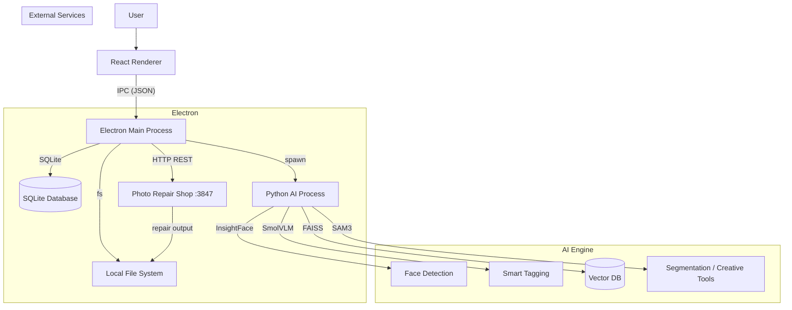
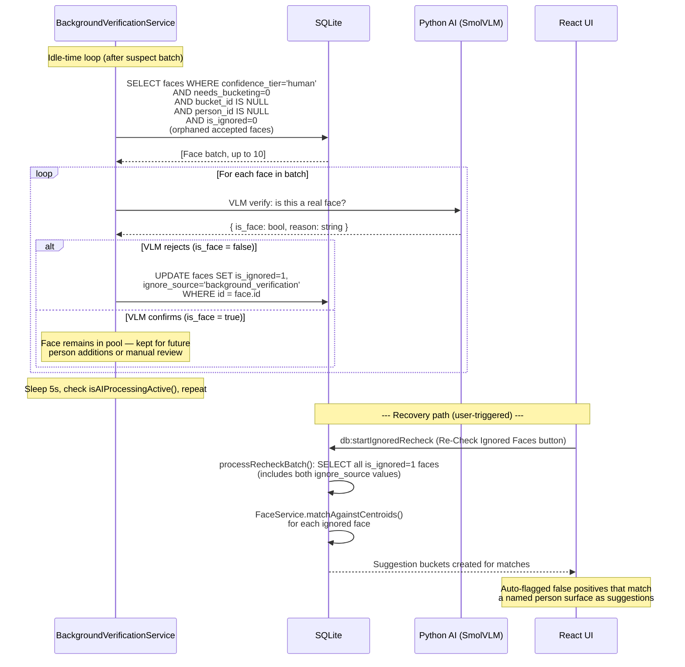

# System Architecture

## Overview

The Smart Photo Organizer is a local-first application built with Electron, React, and Python. It leverages a hybrid architecture where the UI and file management are handled by Node.js/Electron, while heavy AI tasks are offloaded to a dedicated Python subprocess.

## High-Level Diagram



## Component Breakdown

### 1. Renderer Process (Frontend)
- **Tech Stack:** React, TypeScript, Vite, TailwindCSS.
- **Responsibilities:**
  - displaying the photo grid (virtualized).
  - Managing application state (e.g., `AIContext`).
  - Sending commands to the main process via `window.electronAPI`.
  - displaying real-time progress of scans.

### 2. Main Process (Backend)
- **Tech Stack:** Electron, Node.js, SQLite (`better-sqlite3`).
- **Responsibilities:**
  - **Window Management:** Creates and manages the browser window.
  - **IPC Handlers:** `ipcMain.handle` receives requests from the UI.
  - **Database:** Manages `photos.db`, storing metadata, faces, and tags.
  - **Process Management:** Spawns and manages the persistent `python.exe` process (AI Engine). Pipes `stdin`/`stdout` for communication.

### 4. Photo Repair Shop (External Service)
- **Protocol:** HTTP REST on `localhost:3847`. Token auth via `~/.photo-repair-shop/api-token`.
- **Responsibilities:**
  - Analyze corrupt files and suggest repair strategies (`POST /api/analyze`).
  - Execute file repair using header-grafting, preview-extraction, or marker-sanitization (`POST /api/repair`).
  - Report job progress over polling (`GET /api/status/:jobId`).
- **SPO layer:** `electron/lib/prs/` — `PrsClient`, `PrsTokenReader`, `PrsLauncher`.
- **IPC channels:** `prs:checkAvailability`, `prs:analyzeFile`, `prs:pollStatus`, `prs:submitRepair`, `prs:completeRepair`.
- **Integration point:** `electron/ipc/prsHandlers.ts` registered in `main.ts`.

### 3. AI Engine (Python)
- **Tech Stack:** Python 3.12, PyTorch, InsightFace, FAISS, Transformers (HuggingFace).
- **Responsibilities:**
  - **Face Detection:** Uses `RetinaFace` (via `buffalo_l` model) to detect faces with pose invariance.
  - **Face Recognition:** Uses `ArcFace` to generate 512-D embeddings with angular margin loss.
  - **Age/Gender Estimation:** Uses InsightFace `genderage` module for life-stage categorization.
  - **Vector Search:** Uses `FAISS IndexFlatL2` to search face embeddings for identity matching.
  - **Clustering:** Uses `DBSCAN` (scikit-learn) to group unnamed faces by embedding distance.
  - **Smart Tagging:** Uses `SmolVLM` (Vision-Language Model) to caption images and generate tags.
  - **Segmentation:** Uses `SAM 3` (`Sam3Model` + `Sam3Processor` via HuggingFace `transformers`) for interactive image segmentation in Creative Tools. Supports box prompts, point prompts, text prompts, and combined box+points prompts.
- **Technical Deep-Dive:** See [Face Recognition Technology](file:///j:/Projects/smart-photo-organizer/docs/face-recognition-technology.md) for detailed stack analysis.

## Data Flow: AI Scanning

```mermaid
sequenceDiagram
    participant UI as React UI
    participant Main as Electron Main
    participant DB as SQLite
    participant Py as Python AI

    UI->>Main: IPC ai:scanImage(photoId)
    Main->>DB: Get file_path for photoId
    Main->>Py: { type: "scan_image", payload: { path: "..." } } (stdin)
    
    activate Py
    Py->>Py: Load Image (PIL/RawPy)
    Py->>Py: Detect Faces (InsightFace)
    Py->>Py: Smart Crop (Landmarks)
    Py-->>Main: { type: "scan_result", faces: [...] } (stdout)
    deactivate Py
    
    Main->>DB: db:updateFaces (Transaction)
    DB->>DB: Merge/Update Faces
    Main->>DB: db:updateFaces (Transaction)
    DB->>DB: Merge/Update Faces
    Main-->>UI: ai:scan-result (Event)

## Data Flow: Face Clustering (Unnamed Faces)

```mermaid
sequenceDiagram
    participant UI as React UI
    participant Main as Electron Main
    participant DB as SQLite
    participant Py as Python AI

    UI->>Main: IPC ai:getClusteredFaces()
    Main->>DB: Fetch ALL unnamed face descriptors
    DB-->>Main: [Face objects with BLOBs]
    
    Main->>Py: { type: "cluster_faces", faces: [...], eps: 0.800, min_samples: 2, max_spread: 0.75, min_cohesion: 0.6 }
    activate Py
    Py->>Py: DBSCAN (threshold=0.68 → eps=0.800, min_samples=2)
    Py->>Py: Quality filters: spread check (max_spread=0.75), cohesion check (min_cohesion=0.6)
    Py-->>Main: { clusters: { "-1": [], "0": [...], "1": [...] } }
    deactivate Py

    Main->>Main: Re-map IDs to Face Objects
    Main-->>UI: { clusters: [...], singles: [...] }
```

## Data Flow: Image Rotation

```mermaid
sequenceDiagram
    participant UI as React UI
    participant Main as Electron Main
    participant DB as SQLite
    participant Py as Python AI

    UI->>Main: IPC ai:rotateImage(photoId, angle)
    
    activate Main
    Main->>DB: Fetch existing faces
    Main->>Py: { type: "rotate_image", ... }
    Py-->>Main: Success (and new dims)
    
    rect rgb(20, 20, 20)
        note right of Main: **Re-Scan Strategy**
        Main->>Main: Transform old face coords (for matching keys)
        Main->>Py: { type: "analyze_image", ... }
        activate Py
        Py-->>Main: { faces: [NewBoxes...] }
        deactivate Py
        
        Main->>Main: Match NewBoxes to OldBoxes (Heuristic)
        Main->>DB: DELETE old faces
        Main->>DB: INSERT new faces (with preserved PersonIDs)
    end
    
    Main-->>UI: Success
    deactivate Main
```



## Data Flow: File Repair (PRS Integration)

```mermaid
sequenceDiagram
    participant UI as ScanWarningsModal
    participant Main as Electron Main
    participant PRS as Photo Repair Shop :3847
    participant DB as SQLite
    participant Py as Python AI

    Note over UI, DB: User clicks 🔧 on a corrupt scan-error row

    UI->>Main: prs:checkAvailability
    Main->>PRS: GET /health
    PRS-->>Main: 200 OK
    Main-->>UI: { available: true }

    UI->>Main: prs:analyzeFile { filePath, photoId }
    Main->>DB: PhotoRepository.getPhotoById (metadata_json)
    Main->>PRS: POST /api/analyze { filePath, metadata }
    PRS-->>Main: { jobId: "a1" }
    Main-->>UI: { jobId: "a1" }

    loop Every 2s (useRepairJob hook)
        UI->>Main: prs:pollStatus { jobId: "a1" }
        Main->>PRS: GET /api/status/a1
        PRS-->>Main: { status: "done", result: { suggestedStrategies: [...] } }
        Main-->>UI: status payload
    end

    UI->>Main: prs:submitRepair { filePath, strategy, sourcePhotoId }
    Main->>DB: ReferenceRepository.findCandidates (cameraModel, resolution)
    Main->>PRS: POST /api/repair { filePath, strategy, outputPath, candidateReferences }
    PRS-->>Main: { jobId: "b2" }
    Main-->>UI: { jobId: "b2" }

    loop Every 2s
        UI->>Main: prs:pollStatus { jobId: "b2" }
        PRS-->>Main: { status: "repairing", percent: 60 }
        Main-->>UI: progress update
    end

    PRS-->>Main: { status: "done", result: { outputPath: "/photos/x_repaired.jpg" } }
    Main-->>UI: done

    UI->>Main: prs:completeRepair { scanErrorId, originalPhotoId, repairedFilePath }
    Main->>Main: sharp(repairedFilePath).metadata() — decode check
    Main->>Py: analyze_image(repairedFilePath) — AI check
    Main->>DB: deleteScanErrorAndFile(scanErrorId)
    Main->>DB: deletePhotoById(originalPhotoId)
    Main->>Main: scanQueue.enqueueFiles([repairedFilePath])
    Main-->>UI: { success: true }

    Note over UI: Row removed; repaired photo enters library
```

## Data Flow: Background False Positive Re-Verification

Runs during idle time after the main background bucketing pass. Targets `confidence_tier = 'human'` faces that scored ≥ 0.70 (bypassed VLM at scan-time) but never matched any known person and never formed a cluster — the strongest false-positive signal post-scan.



**Key design decisions:**
- `ignore_source = 'background_verification'` separates auto-flagged from user-chosen ignores. The UI can filter or badge these differently.
- Recovery requires **zero new code** — `processRecheckBatch()` already queries all `is_ignored = 1` faces regardless of source.
- Faces rejected by VLM are soft-ignored, not deleted. The user can always recover them via Re-Check Ignored Faces.

## Data Flow: SAM 3 Segmentation (Creative Tools)

```mermaid
sequenceDiagram
    participant UI as CreativeToolsPanel
    participant Main as Electron Main
    participant Py as Python AI (SAM 3)

    UI->>Main: ai:segment:startSession { photoPath }
    Main->>Py: { type: "segment_start_session", payload: { image_path } }
    Py->>Py: Load image, pre-encode with Sam3Processor
    Py-->>Main: { type: "segment_session_started", session_id }
    Main-->>UI: { sessionId }

    alt Box prompt
        UI->>Main: ai:segment:predict { sessionId, box: [x1,y1,x2,y2] }
        Main->>Py: { type: "segment_predict", payload: { session_id, box } }
        Py->>Py: Sam3Model.forward(input_boxes)
        Py-->>Main: { masks: [...], scores: [...] }
        Main-->>UI: { maskBase64, score }
    else Points prompt
        UI->>Main: ai:segment:predict { sessionId, points, point_labels }
        Main->>Py: { type: "segment_predict", payload: { session_id, points, point_labels } }
        Py-->>Main: { masks, scores }
        Main-->>UI: { maskBase64, score }
    else Box + Points (combined)
        UI->>Main: ai:segment:predict { sessionId, box, points, point_labels }
        Main->>Py: { type: "segment_predict", payload: { session_id, box, points, point_labels } }
        Py->>Py: predict_from_box_and_points() — combined Sam3Processor call
        Py-->>Main: { masks, scores }
        Main-->>UI: { maskBase64, score }
    end

    UI->>Main: ai:segment:applyOperation { sessionId, maskBase64, operation, params }
    Main->>Py: { type: "segment_apply", payload: { session_id, mask_b64, operation, params } }
    Py->>Py: Apply operation (cv2 / PIL)
    Py-->>Main: { result_b64: "data:image/png;base64,..." }
    Main-->>UI: result image

    UI->>Main: ai:segment:endSession { sessionId }
    Main->>Py: { type: "segment_end_session", payload: { session_id } }
    Py->>Py: Free cached tensors
    Py-->>Main: { ok: true }
```

**IPC channels:** `ai:segment:startSession`, `ai:segment:predict`, `ai:segment:applyOperation`, `ai:segment:endSession`

**Session model:** Each canvas photo load creates a server-side session that caches the encoded image tensor. Predictions within that session reuse the cached encoding, avoiding re-loading the image on every prompt change. Sessions are cleaned up explicitly on panel close or photo change.

---

## Data Schema

### SQLite Tables
- **photos:** `id`, `file_path`, `preview_cache_path`, `metadata_json`, `created_at`, `sha256_hash` (Phase 107 — exact duplicate detection), `phash` (Phase 107 — perceptual hash for near-duplicate detection, integer), `duplicate_group_id` (FK → `duplicate_groups`, nullable), `gps_lat`, `gps_lon` (Phase 105 — backfilled from `metadata_json`)
- **faces:** `id`, `photo_id`, `box_json`, `descriptor` (BLOB), `person_id`, `is_reference`, `blur_score`, `score` (InsightFace det_score 0–1), `entity_type` ('human'|'pet'|'suspect'), `confidence_tier` ('human'|'suspect' — Phase 90 3-tier scoring), `pose_yaw`, `pose_pitch`, `pose_roll` (Phase 46), `age` (InsightFace estimate), `is_ignored` (boolean), `ignore_source` ('user'|'background_verification'|NULL), `needs_bucketing` (background bucketing flag), `bucket_id` (suggestion/discovery bucket FK), `assignment_source` ('user'|'auto'|'split_multiface'|NULL), `is_confirmed` (centroid stability flag)
- **people:** `id`, `name`, `descriptor_mean_json`, `frontal_centroid_json`, `profile_centroid_json`, `frontal_face_count`, `profile_face_count` (Phase 105 — pose-aware centroids)
- **duplicate_groups:** `id`, `type` ('exact'|'near'), `status` ('pending'|'resolved'|'dismissed'), `winner_photo_id` (FK → photos, nullable), `created_at`, `updated_at` — Phase 107
- **tags:** `id`, `name`
- **photo_tags:** `photo_id`, `tag_id`, `source` ('AI' or 'User')
- **scan_history:** `id`, `photo_id`, `timestamp`, `scan_ms`, `tag_ms`, `face_count`, `status`, `error`
- **scan_errors:** `id`, `photo_id`, `file_path`, `error_message`, `stage`, `timestamp`, `is_unrepairable` — corrupt files logged here; `is_unrepairable=1` is set after a failed PRS repair attempt passes verification

### Vector Store (FAISS)
- Stores 512-dimensional vectors for fast similarity search (currently used internally by Python, but key logic has moved to Node.js for "Mean" calculation).
